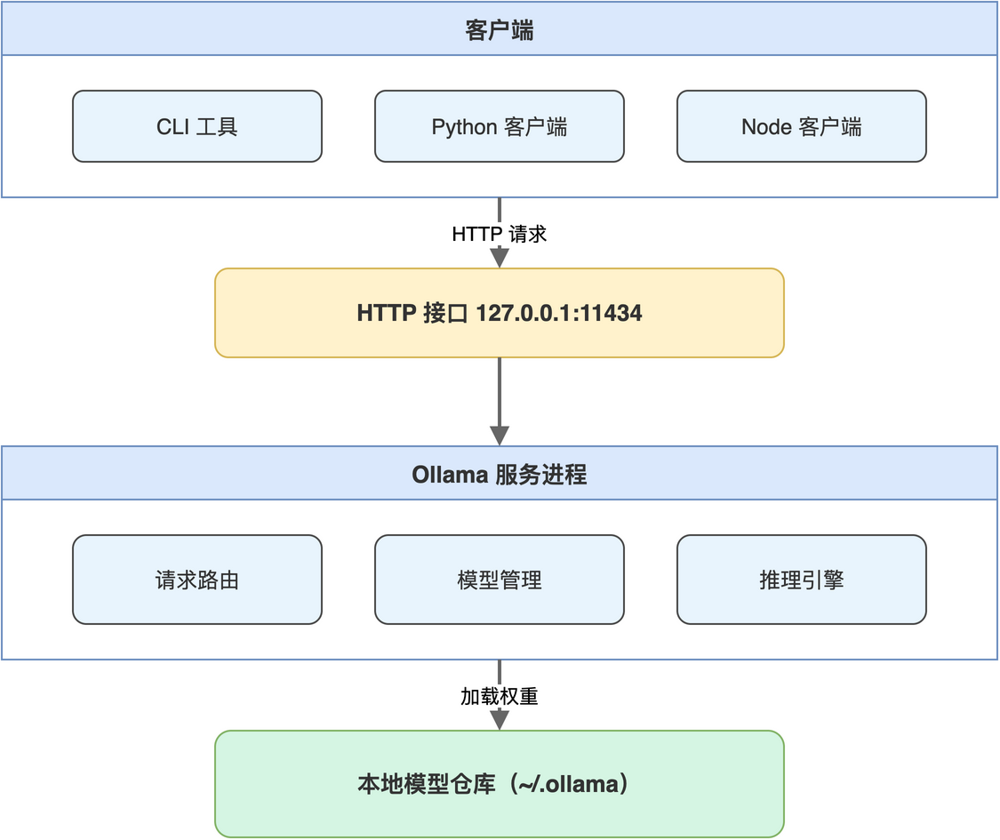

# 第01章 Ollama 本地大模型快速上手

如果读者曾因公司数据安全、网络延迟或调用成本，犹豫是否要把项目接入云端大模型，那么本章将给出一种本地化的解题路径。Ollama 把模型权重下载到本地磁盘，将推理过程封装为一个常驻进程，通过 HTTP 接口对外提供能力，使得在一台普通笔记本上跑起 LLM 与 Embedding 不再需要复杂的环境配置。

本章先把开发机准备成可调用大模型的状态：安装运行时、拉取所需模型、用 CLI 验证生成与对话效果。完成本章后，读者将拥有一个稳定运行的本地推理服务，为后续向量化、检索增强生成、Agent 工具调用打下基础。

## 1.1 Ollama 的定位与组成

Ollama 由命令行工具与本地推理服务两部分组成，前者负责模型管理与交互调试，后者以守护进程方式监听 HTTP 端口，向外暴露生成、对话、嵌入等接口。这种组合让本地大模型的使用方式接近一个轻量数据库：先把数据（模型权重）准备好，再通过协议访问能力。

笔者将 Ollama 在本书项目中的角色概括为三类：作为对话语言模型提供文本生成与多轮对话，作为嵌入模型把任意文本映射为向量，作为外部 LLM 兼容层让后端服务以一致的 HTTP 调用风格接入不同模型。理解了这三种角色，后续 RAG 链路里 Ollama 的每一次出现都不再需要额外解释。

### 1.1.1 本地推理服务的整体结构

Ollama 启动后会以单一进程承担模型加载、显存或内存管理、请求路由等工作。读者可以将其视为一个常驻在 11434 端口的 HTTP 服务，它的内部组件协同关系如图1-1所示。



后续章节中提到的“调用 Ollama”，本质上都是向 11434 端口发起一次 HTTP 请求，由服务进程在内部完成模型加载与推理后返回结果。这条调用链对开发者透明：上层 Python 或 Node 代码只需要拼好 JSON、读出响应即可，与调用普通后端接口的体验一致。

### 1.1.2 模型仓库与命名约定

Ollama 维护了一个模型仓库，按 `名称:标签` 的方式组织。名称对应模型家族（如 llama3.2、qwen2.5、nomic-embed-text），标签标识具体版本或量化精度（如 latest、7b、q4_K_M）。读者在使用过程中应优先记住模型家族名，避免在文档里硬编码具体标签，以便后续替换。

本书的代码中固定使用两个模型，常用模型与用途的对应关系“如表1-1”所示。

**表 1-1 本书所用模型与角色**

| 模型 | 角色 | 典型用途 |
|------|------|---------|
| llama3.2:latest | 对话语言模型 | 流式生成回答、总结工单数据 |
| nomic-embed-text:latest | 嵌入模型 | 把工单文本转为向量供检索使用 |

读者也可以根据本机配置替换为更大或更小的模型，只需保证嵌入模型输出维度与 ChromaDB 集合维度一致即可，相关细节将在向量数据库章节再次说明。

> 注意：模型名称大小写敏感，并且 latest 标签不等于最新版本，而是仓库默认指向的版本，升级模型需要显式重新 pull。

## 1.2 安装与首次运行

Ollama 在 macOS、Linux、Windows 上都提供安装包，安装完成后会同时获得 ollama 命令与后台服务。本节给出最少必要步骤，让一台空机器进入可对话状态。

### 1.2.1 安装 Ollama 运行时

#### 1. 下载安装包

读者打开 Ollama 官网（ollama.com），按操作系统选择对应安装包。macOS 用户得到一个 .dmg 文件，双击后将应用拖入 Applications 即可；Linux 用户通常使用官方提供的安装脚本完成一键安装；Windows 用户得到一个 .exe 安装程序，按向导默认安装即可。

#### 2. 启动后台服务

安装完成后，Ollama 会在登录时自动启动后台服务，监听 127.0.0.1:11434。如果服务未启动，可手动执行启动命令：

```bash
ollama serve
```

该命令会以前台方式启动服务，便于在调试阶段观察日志。生产或日常使用时一般依赖系统级守护即可，无需手动执行。

#### 3. 验证服务可达

服务启动后，向 11434 端口发起一次健康检查，确认 HTTP 接口可访问：

```bash
curl http://localhost:11434
```

正常情况下返回字符串 “Ollama is running”。如果返回连接拒绝，应排查 Ollama 应用是否已启动、是否被代理或防火墙拦截。

> 注意：在公司内网环境中，部分 HTTP 代理会拦截 127.0.0.1 的流量，建议将 localhost 与 127.0.0.1 加入 NO_PROXY 环境变量后再调试。

### 1.2.2 拉取本书所需模型

模型权重需要在首次使用前下载到本地，下载完成后才能被推理服务加载。下载命令使用 ollama pull，命令格式与 docker pull 一致。本书需要两个模型，分别承担对话与嵌入角色。

```bash
ollama pull llama3.2:latest
ollama pull nomic-embed-text:latest
```

llama3.2:latest 在 8GB 内存机器上即可运行较小尺寸的量化版本，nomic-embed-text 体积较小，下载时间通常在分钟级。下载过程中 Ollama 会显示分层进度，与容器镜像拉取类似。

下载完成后用 ollama list 查看本地已存在的模型：

```bash
ollama list
```

输出会列出模型名、参数规模、文件大小与最近修改时间。读者可对照确认两个模型均已就绪。

> 注意：模型默认存储在用户目录下的 .ollama 文件夹，迁移机器或更换磁盘前应一并备份该目录，避免重新下载。

### 1.2.3 用 CLI 做第一次对话

ollama run 命令直接进入交互式对话，可用于快速验证模型行为，无需写代码。

```bash
ollama run llama3.2
```

执行后会出现一个提示符，读者输入“你好，简单介绍一下你自己”后按回车，模型即开始流式输出回答。要退出对话，输入 /bye 或按 Ctrl+D。

CLI 的常用子命令与对应场景如下：

```bash
ollama run llama3.2          # 进入交互对话
ollama list                  # 查看本地已下载模型
ollama stop llama3.2         # 停止指定模型占用的显存或内存
ollama rm llama3.2           # 删除本地模型文件
```

CLI 主要用于探索与调试，正式的应用集成应改走 HTTP 接口，这部分内容将在下一章展开。

## 1.3 选择与切换模型的考量

模型不是越大越好，本地推理受限于内存、显存与延迟，需要根据任务类型与硬件能力做出平衡。本节给出本书后续章节涉及的几个判断维度，供读者结合自身环境调整。

### 1.3.1 对话模型的选型维度

判断对话模型是否适合本地部署，主要看三方面：是否能在目标硬件上稳定运行、生成质量是否满足任务需求、流式响应是否足够流畅。

笔者在本书示例中选择 llama3.2，是因为它的 1B 至 8B 量化版本可以在常见笔记本上跑起来，对中文工单的总结表达基本可用，且与 Ollama 主分支兼容性好。如果读者机器配置较高，可以替换为 qwen2.5、deepseek-r1 等中文表现更佳的模型，只需在后续代码中修改模型名即可，HTTP 调用接口完全一致。

### 1.3.2 嵌入模型的选型维度

嵌入模型的核心指标是向量维度、领域覆盖与速度。维度决定了向量数据库存储与计算成本，领域覆盖决定了相似度计算的有效性，速度决定了知识库构建过程是否可接受。

本书使用 nomic-embed-text:latest，输出 768 维向量。这一维度在检索效果与存储成本之间取得平衡，对通用中文短文本表现稳定，适合工单这种结构相对固定的场景。读者若有更高检索精度需求，可考虑 bge-m3 等多语言嵌入模型，但需注意切换嵌入模型后必须重建整个向量库，因为不同模型生成的向量空间彼此不可比。

> 注意：同一个 ChromaDB 集合内的向量必须由同一个嵌入模型生成，混用不同维度或不同模型的向量会导致检索结果完全失效。

## 1.4 本章小结

到此为止，读者的开发机已经具备本地大模型的全部基础能力：Ollama 服务常驻在 11434 端口，llama3.2 与 nomic-embed-text 两个模型已经下载就绪，并且通过 CLI 完成了首次对话验证。

接下来的工作不再使用 CLI，而是把 Ollama 当作普通 HTTP 服务来用。下一章笔者将带领读者用 Python 直接调用 Ollama 的 /api/chat 接口，理解流式响应的解码方式，并把它封装为一个可在后端服务中复用的最小调用单元。

本章配套源码：https://github.com/kang-airtc/agent-ollama-book
