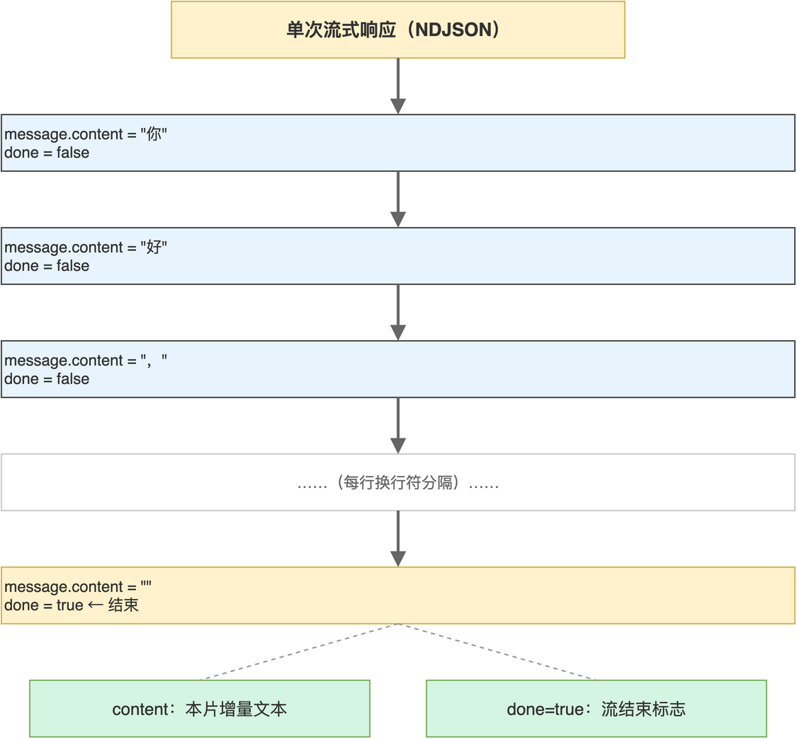

# 第02章 Ollama HTTP API 与流式响应

在前一章中，笔者完成了 Ollama 的安装与 CLI 验证。CLI 适合人机对话调试，对应用集成来说仍然不够直接：业务代码无法读取 CLI 进程的输出，也无法控制并发与超时。Ollama 真正向应用开放的能力，是常驻在 11434 端口的 HTTP 接口。本章把这条 HTTP 通道彻底走通，让读者在不依赖任何 SDK 的前提下，用 Python 的 requests 与 httpx 实现生成、对话与流式响应解码。

完成本章后，读者将能写出可被后端服务直接复用的 Ollama 调用函数，理解 NDJSON 流式协议的特征，并能在网络异常、模型未加载等边界场景下做出合理处理。

## 2.1 接口家族与调用风格

Ollama 暴露的 REST 接口都以 /api 为前缀，覆盖生成、对话、嵌入、模型管理等场景。本书重点使用其中三个：/api/generate 用于一次性生成、/api/chat 用于多轮对话、/api/embeddings 用于向量化。所有接口的认证方式相同：本地服务默认不需要 Token，远程访问则建议放在反向代理后做最简单的网络层鉴权。

### 2.1.1 接口分类与场景对应

笔者将本书会用到的 Ollama HTTP 接口与典型场景的对应关系总结于一表，方便读者后续查阅。常用接口“如表2-1”所示。

**表 2-1 Ollama 常用 HTTP 接口**

| 路径 | 方法 | 用途 | 流式支持 |
|------|------|------|---------|
| /api/generate | POST | 单轮文本生成 | 是 |
| /api/chat | POST | 多轮对话生成 | 是 |
| /api/embeddings | POST | 文本向量化 | 否 |
| /api/tags | GET | 列出本地模型 | 否 |
| /api/show | POST | 查看模型元数据 | 否 |

本章重点演示前两个，第三个嵌入接口将在向量化章节展开。后两个查询类接口主要用于运维或调试场景，本书不做专题展开，读者可在 Ollama 官方文档中按需查阅。

### 2.1.2 请求负载的通用字段

Ollama 的生成与对话接口共享一套基础字段，理解它们能让读者快速读懂示例代码。最常用的字段及作用“如表2-2”所示。

**表 2-2 生成与对话接口的常用字段**

| 字段 | 类型 | 作用 |
|------|------|------|
| model | string | 指定使用的模型名，需与本地已 pull 的名称一致 |
| prompt | string | 单轮生成接口的输入文本 |
| messages | array | 对话接口的消息列表，元素为带 role 与 content 的对象 |
| system | string | 系统提示，约束模型角色或风格 |
| stream | bool | 是否以流式方式返回，默认为 true |
| options | object | 推理参数，常见为 temperature、num_predict |

stream 字段在本章占据核心位置：当其为 true 时，Ollama 用 NDJSON 协议把生成片段逐条推送回客户端；为 false 时则等待整段生成完成再一次性返回。后续章节中 SSE 流式后端正是建立在 stream=true 之上的。

> 注意：messages 中的 role 字段只接受 system、user、assistant 三种值，写错会导致 400 错误，错误信息常被流式输出掩盖，调试时建议先关闭流式确认请求格式。

## 2.2 用 requests 调用对话接口

requests 是 Python 同步 HTTP 库的事实标准，本节先用它完成一次最小可行的 Ollama 调用。配套源码中的 test_ollama.py 就是这条路径的实现，本节顺着它展开讲解。

### 2.2.1 构造一次对话请求

最小的对话请求包含模型名与消息列表两个必填项，调用方式如下。

```python
import requests

response = requests.post(
    "http://localhost:11434/api/chat",
    json={
        "model": "llama3.2:latest",
        "messages": [{"role": "user", "content": "请介绍一下Ollama并用中文回答."}],
    },
    stream=True,
)
```

代码中 stream=True 起到双重作用：HTTP 客户端层面允许逐块读取响应体，Ollama 服务端层面则按 NDJSON 协议分片推送。两者必须配合，否则要么解析失败，要么白白等待完整响应。

读者可以暂时把 prompt 中的请求语句替换成任意问题，验证模型对中文与英文输入的响应差异，从而对模型能力建立直观印象。

### 2.2.2 解析 NDJSON 流式响应

流式响应中每一行都是一个独立的 JSON 对象，行末以换行符分隔，整体不是合法 JSON 数组，而是 Newline Delimited JSON（简称 NDJSON）。读取方式是按行迭代，每行单独 json.loads。

```python
for line in response.iter_lines():
    if line:
        data = line.decode("utf-8")
        print(data)
```

直接 print 出来的每一行结构与字段含义“如图2-1”所示。



每一行包含若干字段，其中 message.content 是本片增量文本，done 表示本次生成是否结束。把所有非空 content 拼接起来，就是模型完整回答。读者可在 test_ollama.py 基础上加一行 json.loads 与拼接逻辑，得到等价于 CLI 输出的最终文本。

> 注意：流式响应的最后一行 done 为 true 且 content 通常为空，循环中不要因为遇到空 content 而提前 break，必须等到 done 为真才结束。

### 2.2.3 健壮性与错误处理

最小示例没有处理网络异常与服务错误，正式代码需要补充三类防御：连接异常、HTTP 状态码非 200、响应行解析失败。常见错误类型与建议处理“如表2-3”所示。

**表 2-3 Ollama HTTP 调用的常见错误**

| 错误类型 | 触发原因 | 建议处理 |
|---------|---------|---------|
| ConnectionError | Ollama 服务未启动或端口不通 | 提示用户启动 Ollama，并在日志中给出 11434 端口检查命令 |
| 404 model not found | 请求的模型未 pull 到本地 | 在响应中给出可执行的 pull 命令 |
| Timeout | 模型加载或生成超时 | 适当延长 timeout，必要时改为异步调用 |
| JSONDecodeError | 响应行残缺或包含空字节 | 跳过该行并记录日志，不影响整体生成 |

笔者建议把上述处理统一封装到一个 chat 函数里，对外只暴露 prompt 与 model 两个参数，函数内部完成 URL 拼接、错误分类、流式拼接。后续章节中 backend/main.py 的 stream_ollama_llm 函数正是这条思路的进一步演化。

## 2.3 用 httpx 做异步流式调用

requests 是同步库，适合脚本与测试；进入 FastAPI 后端服务时，需要换用支持 async 的客户端，避免阻塞事件循环。httpx 提供与 requests 相近的 API，同时支持异步上下文与流式读取，是 Ollama 在后端最常用的搭档。

### 2.3.1 异步客户端与上下文管理

httpx 推荐用 AsyncClient 作为异步上下文管理器，进入时建立连接池，退出时自动释放。下面示例改写自 backend/main.py 中的 stream_ollama_llm 函数。

```python
import httpx

async def stream_chat(prompt: str, model: str = "llama3.2:latest"):
    payload = {
        "model": model,
        "messages": [{"role": "user", "content": prompt}],
        "stream": True,
        "options": {"temperature": 0.7, "num_predict": 2000},
    }
    async with httpx.AsyncClient(timeout=120.0) as client:
        async with client.stream(
            "POST",
            "http://localhost:11434/api/chat",
            json=payload,
        ) as response:
            response.raise_for_status()
            async for line in response.aiter_lines():
                if line.strip():
                    yield line
```

整段代码以异步生成器形式对外提供，每个 yield 出去的就是一段流式响应行。调用方可以再做一次 json 解析与片段拼接，得到可推给前端的文本块。

### 2.3.2 超时与取消的实践

本地大模型生成耗时不稳定，简单设置 timeout 不足以覆盖所有情况，需要在三个层面综合处理。常见做法“如表2-4”所示。

**表 2-4 异步流式调用的稳定性手段**

| 手段 | 作用 | 建议值或写法 |
|------|------|-------------|
| 连接超时 | 防止 Ollama 未启动时长时间阻塞 | httpx.Timeout(connect=5.0) |
| 读超时 | 控制单次响应等待上限 | 单独配置 read 参数，典型 60 至 120 秒 |
| 任务取消 | 客户端断开时尽快中止后端生成 | 用 anyio 或 asyncio 监听断连事件 |

后续章节里 FastAPI 接收前端断开请求后，会触发协程取消，httpx 的 stream 上下文会一并退出，最终关闭与 Ollama 的连接。这条链路读者目前只需要知道存在，具体实现细节将在 RAG 后端章节再展开。

> 注意：把 timeout 设得过短会导致大模型推理被中途打断，过长则前端长时间等不到任何反馈，建议配合心跳事件或加载提示给出体验上的兜底。

## 2.4 本章小结

本章把 Ollama 的 HTTP 接口拆解清楚：从最小 requests 示例理解 NDJSON 流式协议，再升级到 httpx 异步流式调用以适配后端服务。读者现在已经具备直接驱动本地大模型的能力，可以脱离 CLI，把它当作一个普通的 HTTP 服务来用。

下一章笔者将转向数据侧：要让本地 LLM 能基于私有知识回答问题，先要把原始文本切成大小适中的块。文本切片是检索增强生成链路上看似不起眼但至关重要的一环，做得好与不好直接决定后续向量检索的效果。

本章配套源码：https://github.com/kang-airtc/ollama-mini-book
