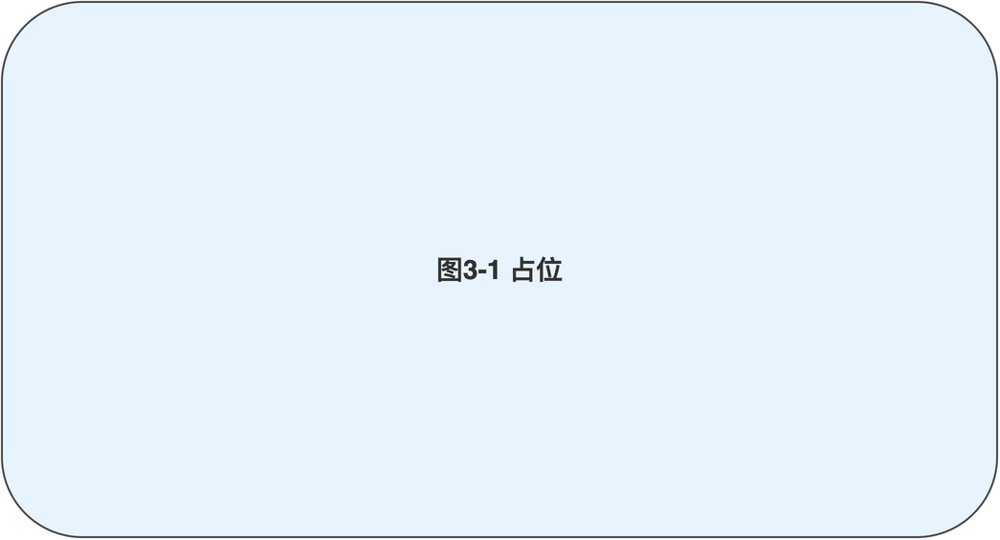
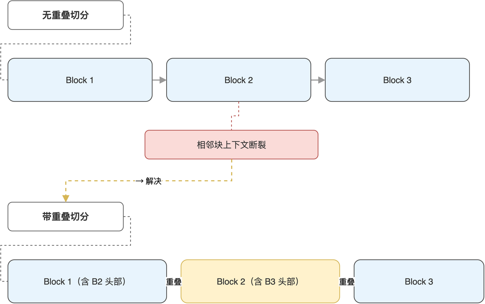

# 第03章 文本切片：为向量化准备数据

掌握了 Ollama HTTP 接口之后，读者已经可以让本地大模型回答任何问题。但模型只能基于训练数据回答，对私有知识、最新事件、企业内部文档一无所知。检索增强生成的思路是先把外部资料拆成可检索的小块，存入向量数据库，回答时按相关性把若干小块取出，与问题一起交给模型。这条链路的第一步就是文本切片。

本章解释切片的必要性、常见策略与代码实现，使用配套源码中的 test_text_split.py 作为基准实现。完成本章后，读者将能够根据文档类型选择合适的切片方式，并理解为什么“切多大、怎么重叠”会直接影响后续检索效果。

## 3.1 切片在 RAG 链路中的位置

检索增强生成的标准链路由四个环节构成：切片、向量化、检索、生成。后三步的有效性都建立在第一步之上：如果切片大小不合理、上下文丢失严重，无论嵌入模型多优秀、检索算法多精细，都难以取出真正与问题相关的内容。

### 3.1.1 为什么不能直接把整篇文档喂给模型

直接把整篇文档作为 prompt 交给模型，看似省事，实际有三类问题。常见障碍“如表3-1”所示。

**表 3-1 不做切片直接传整篇文档的常见问题**

| 问题 | 表现 | 根本原因 |
|------|------|---------|
| 上下文超限 | 长文档超过模型最大 token 数被截断 | 本地模型上下文窗口一般在 8K 至 32K |
| 信息噪声 | 模型被大段无关内容干扰，回答跑题 | 注意力分散到与问题无关的段落 |
| 推理变慢 | 单次生成耗时显著上升 | token 数越多，逐 token 解码越久 |

切片不是为了把文档塞进窗口，而是为了让检索阶段能精准地命中真正相关的段落，把噪声留在数据库里、把信号送到模型面前。

### 3.1.2 切片粒度的基本权衡

切得过大，单块包含太多主题，检索时一块顶多匹配一个意图，召回不精；切得过小，单块语义不完整，模型即便拿到也无法形成有效上下文。整条 RAG 链路与切片粒度的关系“如图3-1”所示。



工程实践中，切片的大小通常需要根据文档结构与模型上下文窗口反复调整。本书涉及的工单文本结构相对规整，每条工单本身就是一个语义单元，切片粒度可以与工单粒度对齐；对于长篇说明文档，则需要按段落或固定字符数切，并辅以重叠区策略。

## 3.2 按段落切分的最小实现

本节先实现一个最小可用的切分函数，按双换行符把文本切成若干段落块。这个版本来自 test_text_split.py，足以处理结构良好的纯文本。

### 3.2.1 切分函数的核心逻辑

按段落切分的核心是选定分隔符并清理空块。代码非常短，但每一行都有目的。

```python
def split_text_by_paragraphs(text, separator="\n\n"):
    chunks = []
    raw_chunks = text.split(separator)
    for chunk in raw_chunks:
        cleaned = chunk.strip()
        if cleaned:
            chunks.append(cleaned)
    return chunks
```

代码做了三件事：用双换行符切分得到原始块、用 strip 去掉块首尾空白、用 if cleaned 过滤掉空块。第三步看似多余，实际上原始文本里常常出现连续多个空行，不过滤就会留下大量空字符串扰乱后续向量化。

### 3.2.2 在脚本中读取与切分

配套的 test_text_split.py 提供了从文件加载并切分的封装，便于读者直接对一个文本文件做实验。

```python
def load_and_split_text(filepath, separator="\n\n"):
    with open(filepath, "r", encoding="utf-8") as f:
        text = f.read()
    return split_text_by_paragraphs(text, separator)
```

笔者建议读者准备一份自己的纯文本资料（比如一段产品说明、一段博客文章），用上述函数切一次，观察输出的块数与每块的长度分布。这一步是后续选择重叠策略的判断基础：如果每块平均 200 字以上，可能不需要重叠；如果平均 50 字以下，则要考虑改用更大的分隔单位或合并相邻块。

> 注意：Windows 与 Mac 系统在某些文本编辑器里的换行符不同，纯按 \n\n 切分可能在跨平台文件上失败，正式使用前应先做一次换行符归一化。

## 3.3 带重叠的切分策略

仅靠段落分隔，相邻块之间彼此独立、上下文割裂。当一个问题的答案恰好横跨两个段落时，无论检索算法多准，都只能取到其中之一。重叠切分让相邻块共享一部分内容，缓解这个问题。

### 3.3.1 重叠区的作用

重叠区是指当前块的前若干字符来自上一块的末尾。这样做的代价是同一段文本在数据库中出现两次（部分内容），但收益是检索时跨段落的语义连续性得到保留。常见的重叠长度在 30 至 100 字符之间，具体取值与切片大小成正比。重叠切分与无重叠切分的对照“如图3-2”所示。



读者应根据文档类型选择重叠长度：知识库文档段落较长，重叠 50 字左右即可；技术博客代码块多、段落短，重叠可降到 30；工单数据每条独立，几乎不需要重叠。

### 3.3.2 实现重叠切分

在已有的段落切分基础上加一段拼接逻辑即可实现重叠切分。

```python
def split_text_with_overlap(text, separator="\n\n", overlap=50):
    chunks = split_text_by_paragraphs(text, separator)
    if len(chunks) <= 1:
        return chunks
    overlapped_chunks = []
    for i, chunk in enumerate(chunks):
        if i > 0 and overlap > 0:
            prev_end = chunks[i - 1][-overlap:]
            chunk = prev_end + chunk
        overlapped_chunks.append(chunk)
    return overlapped_chunks
```

代码的关键点是 prev_end = chunks[i - 1][-overlap:]：从上一块末尾截取 overlap 个字符，拼到当前块前面。第一块没有前驱，保持原样。如果整个文档只有一块，则跳过重叠逻辑直接返回。

笔者强调一点：重叠是检索阶段的一种冗余补偿，不是越多越好。过多重叠会让向量数据库存储成本与检索时去重逻辑都变得复杂，反而拖累工程实现。

### 3.3.3 切片策略的选择建议

不同场景下的切片策略选择“如表3-2”所示。

**表 3-2 常见文档类型的切片策略建议**

| 文档类型 | 切分单位 | 重叠 | 说明 |
|---------|---------|------|------|
| 工单或问答对 | 单条记录 | 无 | 每条自带完整语义，独立成块 |
| 技术博客 | 段落 | 30 至 50 | 段落较短，重叠避免跨段语义丢失 |
| 长篇说明文档 | 段落或固定长度 | 80 至 150 | 上下文跨度大，需要明显重叠 |
| 源代码 | 函数或类 | 无 | 函数本身是语义单元 |
| 对话记录 | 整段对话或固定轮数 | 1 至 2 轮 | 保持对话上下文连续 |

读者在实际项目中可以先按表中建议起步，再根据检索效果观察调整。常见的判断方式是抽取若干典型问题，看检索回的块是否覆盖了答案所在段落；若覆盖不足，先增大重叠，再考虑减小切片大小。

> 注意：切片策略一旦改变，向量数据库需要重新构建，因为存量数据的块边界、ID 与新策略不一致，混用会导致检索结果失真。

## 3.4 文本预处理的常见步骤

切片之前往往还需要一些预处理，使得相邻段落更容易被算法识别。本节不展开实现细节，给出读者后续可以自行加入的几个常见动作。

### 3.4.1 归一化与噪声清理

原始文档常含有多余的空白、HTML 标签残留、控制字符等。归一化的目的是让切分逻辑面对的输入尽可能一致。典型动作包括把全角空格转半角、把多个连续空行压缩为一个、剥离 HTML 标签或 Markdown 装饰符号。

笔者建议把预处理函数与切片函数分开实现，分层处理便于按文档类型替换预处理逻辑而不影响切分。

### 3.4.2 结构感知的切分

对于带明显结构的文档（如 Markdown、HTML、PDF 抽取后的文本），按结构标记切分通常优于按字符切分。比如 Markdown 文档按二级标题切分，HTML 按 `<section>` 切分，PDF 按页或按抽取出的章节标记切分。

结构感知切分的优势在于保留语义边界。后续章节中如果读者需要把企业内部文档接入 RAG 系统，建议优先采用结构感知切分而非纯字符切分。

> 注意：结构感知切分依赖文档原始格式，一旦上游格式变化（如导出工具更新），切分逻辑可能失效，需要建立回归测试以便及时发现。

## 3.5 本章小结

本章把切片这件事拆成三个层面：为什么要切（避免上下文超限与信息噪声）、怎么切（按段落或按结构）、要不要重叠（按场景判断）。配套源码 test_text_split.py 提供了最小可用的实现，足以应对工单这类结构规整的数据。

切好的文本块还只是字符串，无法直接被相似度检索使用。下一章笔者将带读者把每个文本块送进 Ollama 的嵌入模型，得到 768 维向量，并理解余弦相似度如何把语义“接近”转换为可计算的数字。

本章配套源码：https://github.com/kang-airtc/ollama-mini-book
