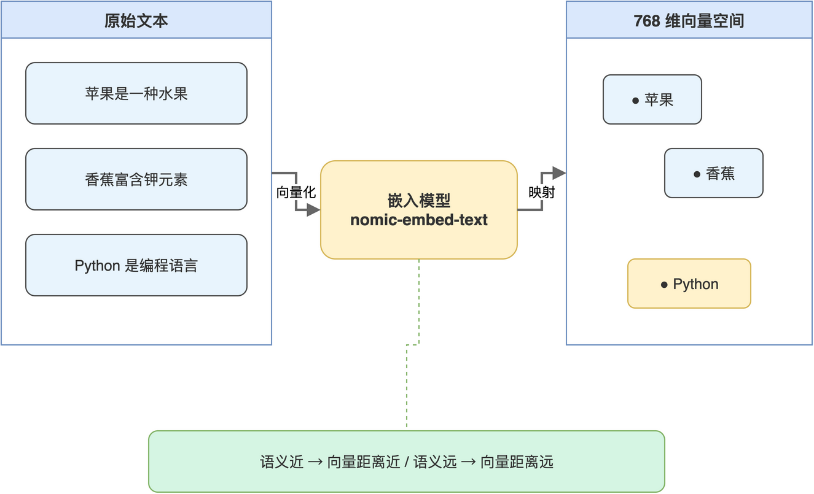
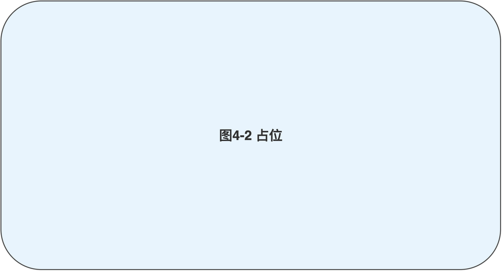

# 第04章 Embedding 向量化原理与实战

切好的文本块还停留在字符串状态，无法直接用于相似度检索。要让机器判断“用户问题”与“知识块”之间是否相关，必须先把它们映射到同一个数学空间，再用距离或夹角衡量接近程度。完成这一映射的模型叫嵌入模型，输出结果通常是几百到几千维的浮点向量。

本章基于配套源码中的 test_embedding_ollama.py，讲清楚 Ollama 嵌入接口怎么调用、返回的向量如何理解、余弦相似度如何计算。完成本章后，读者能够把一组文本变成一组向量，并对任意两个文本块给出量化的相似度分数。

## 4.1 嵌入模型解决了什么问题

嵌入模型解决的是“把语义放到坐标系里”这件事。把每条文本变成一组数值，让语义上相近的文本在该坐标系里靠得近，语义无关的文本则相距较远。这种转换是后续向量检索能够工作的前提。

### 4.1.1 向量空间的直观理解

读者可以把嵌入模型想象成一个翻译器：输入任意一段中文或英文文本，输出一组 768 个浮点数。这组浮点数共同确定了一个点，在 768 维空间中的位置。语义接近的文本，对应点彼此靠近；语义无关的文本，对应点相隔较远。向量空间中文本之间的关系“如图4-1”所示。



读者不必为 768 维这种数字而困惑：低维（如二维或三维）只是便于人类绘图理解，高维空间在数学上完全等价，并且能更细致地区分语义差异。可以认为维度越高，模型可表达的语义维度越多。

### 4.1.2 相似度度量的选择

把文本映射到向量空间后，需要一个度量方式来衡量两个向量的“接近”。最常用的两种是余弦相似度与欧氏距离。两种度量的对比“如表4-1”所示。

**表 4-1 余弦相似度与欧氏距离的差异**

| 维度 | 余弦相似度 | 欧氏距离 |
|------|----------|---------|
| 数学含义 | 向量夹角的余弦值，范围 -1 至 1 | 两点之间的直线距离 |
| 受向量长度影响 | 不受影响，只关心方向 | 受影响，长向量距离也大 |
| 适用场景 | 文本嵌入、语义检索 | 几何或像素空间检索 |
| 高分代表 | 越接近 1 越相似 | 越接近 0 越相似 |

文本嵌入领域通用做法是余弦相似度，原因在于嵌入向量的“长度”往往与文本长度有相关性，而长度差异不应被解读为语义差异。本书后续所有相似度计算都基于余弦相似度。

> 注意：部分向量数据库底层用欧氏距离实现，但只要把向量先做 L2 归一化，欧氏距离与余弦距离结果等价，读者切换数据库时无需重做向量化。

## 4.2 调用 Ollama 的嵌入接口

Ollama 提供 /api/embeddings 接口，输入一段文本与模型名，输出对应向量。本节用 test_embedding_ollama.py 中的 get_embedding 函数演示一次完整调用。

### 4.2.1 最小可用的调用函数

嵌入接口与对话接口在调用风格上一致，差别只在返回结构与不支持流式。

```python
import requests

def get_embedding(text, model="nomic-embed-text:latest"):
    url = "http://localhost:11434/api/embeddings"
    payload = {"model": model, "prompt": text}
    try:
        response = requests.post(url, json=payload)
        response.raise_for_status()
        result = response.json()
        return result.get("embedding", [])
    except Exception as e:
        print(f"获取嵌入失败: {e}")
        return []
```

函数对外暴露 text 与 model 两个参数，对内完成 URL 拼接、错误兜底、字段提取。返回值是一个长度为 768 的 list[float]。读者可以打印 len(embedding) 验证维度是否符合预期，并打印 embedding[:5] 观察向量前几个分量。

### 4.2.2 批量向量化的实践要点

实际项目里很少只对一段文本做嵌入，更多是对几百几千条文本批量向量化。批量调用需要注意三件事：调用频率、超时与失败重试、内存占用。

```python
embeddings = []
for i, chunk in enumerate(chunks, 1):
    print(f"处理第 {i}/{len(chunks)} 个文本块...", end=" ")
    embedding = get_embedding(chunk)
    if embedding:
        embeddings.append({
            "id": f"chunk_{i}",
            "text": chunk,
            "embedding": embedding,
            "vector_dim": len(embedding),
        })
        print(f"成功 (维度: {len(embedding)})")
    else:
        print("失败")
```

代码中的进度打印不仅便于观察，也有助于在异常发生时迅速定位是第几条出错。读者在生产环境中可以把 print 换成结构化日志，并把失败的 chunk id 单独记录，以便重试。

> 注意：本地 Ollama 不限制嵌入接口并发，但实际并发能力受 CPU 与内存限制，单进程顺序调用通常足够，引入多线程时需要测试避免反而变慢。

### 4.2.3 嵌入结果的持久化

向量化是一次性成本较高的过程，处理完成后通常会持久化保存，避免重复计算。test_embedding_ollama.py 的演示是把结果存成 JSON 便于检查，正式项目应直接写入向量数据库。

```python
output_data = []
for item in embeddings:
    output_data.append({
        "id": item["id"],
        "text_preview": item["text"][:100],
        "vector_dim": item["vector_dim"],
        "vector_sample": item["embedding"][:10],
    })

with open("embeddings_result.json", "w", encoding="utf-8") as f:
    json.dump(output_data, f, ensure_ascii=False, indent=2)
```

上述代码只保存了向量的前 10 个分量与文本预览，是为了让 JSON 文件可读、便于调试。正式入库时则需要保留完整向量，并附带原始文本与必要的元数据（如来源文档 ID、章节标题、创建时间）。后续章节中 ChromaDB 会提供更合适的存储方式。

## 4.3 余弦相似度的计算与解读

得到向量后，下一步是用相似度衡量两条文本之间的语义距离。本节用 numpy 实现余弦相似度，并通过一组示例帮助读者建立直观判断。

### 4.3.1 余弦相似度的最小实现

余弦相似度的数学定义是两个向量内积除以两者模长的乘积。numpy 一行可以实现。

```python
import numpy as np

def cosine_similarity(vec1, vec2):
    vec1 = np.array(vec1)
    vec2 = np.array(vec2)
    return np.dot(vec1, vec2) / (
        np.linalg.norm(vec1) * np.linalg.norm(vec2)
    )
```

读者把同一段文本传入两次，应得到接近 1.0 的值；把完全无关的两段文本传入，结果一般在 0.2 至 0.5 之间；语义相近但措辞不同的文本则在 0.6 至 0.85 之间。这种粗略区间是后续设定检索阈值的参考依据。

### 4.3.2 相似度分布与阈值

不同嵌入模型的相似度分布特性不同，nomic-embed-text 在中文场景下的常见分布与建议解读“如表4-2”所示。

**表 4-2 nomic-embed-text 中文场景的相似度区间参考**

| 区间 | 典型含义 | 检索决策建议 |
|------|---------|------------|
| 0.85 及以上 | 同主题且措辞接近 | 高置信召回 |
| 0.70 至 0.85 | 同主题但视角不同 | 召回并交给模型判断 |
| 0.55 至 0.70 | 主题相关但侧重不同 | 召回兜底，按需展示 |
| 0.55 以下 | 主题不相关 | 不召回 |

读者需要意识到，阈值不是绝对的，需要在自己的数据集上通过若干典型问题做实验得出。本书的工单场景，召回阈值通常设在 0.55 至 0.65 之间，避免大量真正相关但措辞不同的工单被遗漏。

### 4.3.3 在 RAG 链路中的位置

向量化与相似度计算只是手段，最终目的是为生成阶段提供高质量上下文。RAG 链路中向量化与检索的衔接位置“如图4-2”所示。



读者从这张图可以看到，嵌入模型同时作用于两侧：构建知识库时对每个文档块做一次向量化，检索时对用户问题做一次向量化，二者在同一空间中比较。这就要求两侧必须使用同一个模型与同一个维度，否则向量空间不可比。

> 注意：替换嵌入模型必须同步重建整个向量库，包括重新计算每条历史数据的向量；混用不同模型生成的向量会让检索结果完全失真。

## 4.4 本章小结

本章把嵌入这件事从原理到代码走了一遍：嵌入把文本映射到高维向量空间、余弦相似度衡量向量接近度、Ollama 提供 768 维的 nomic-embed-text 嵌入接口、批量向量化与持久化构成了知识库构建的核心步骤。

到这里为止，读者已经能把任意一组文本变成向量，并对两两之间的相似度做出量化判断。接下来需要一个专门为向量设计的存储引擎，让“近似最近邻”检索能在毫秒级完成。下一章笔者将把所有向量交给 ChromaDB 管理，搭建出 RAG 知识库的存储底座。

本章配套源码：https://github.com/kang-airtc/ollama-mini-book
