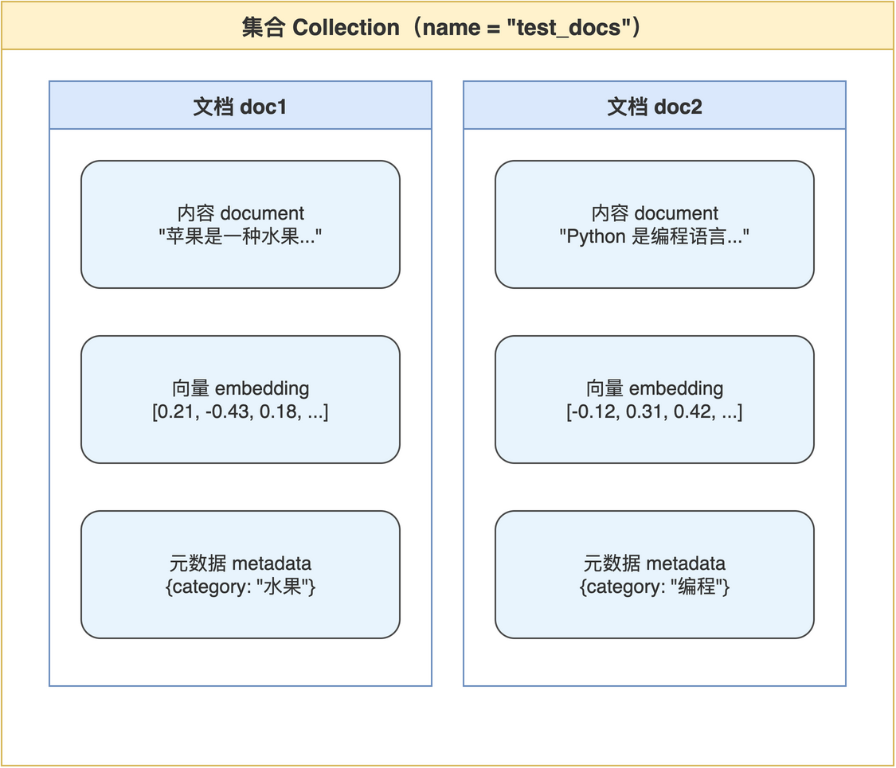

# 第05章 ChromaDB 向量数据库入门

得到向量之后，如果只是把它们存在 JSON 或内存数组里，检索时就只能对每条向量逐一计算相似度。条数上千之后这种方式会变得明显迟钝，更严重的是缺少持久化、索引、元数据过滤等数据库应有的能力。向量数据库就是为这一场景而生：把高维向量当作一等数据存储，并为相似度检索建立索引。

本章用配套源码中的 test_chroma.py 作为最小示例，介绍 ChromaDB 的数据模型、写入与检索方式、元数据过滤。完成本章后，读者可以独立搭建一个小型向量知识库，把上一章生成的向量送进去做相似度查询。

## 5.1 向量数据库的核心概念

ChromaDB 是一款专注于向量检索的开源数据库，定位介于“专业向量数据库”与“轻量本地存储”之间，特别适合从原型走向小规模生产的项目。本节先把它的数据模型与本书项目的对应关系讲清楚。

### 5.1.1 集合、文档与元数据

ChromaDB 的数据模型由三个核心概念组成：集合（Collection）、文档（Document）、元数据（Metadata）。三者的关系类似于关系数据库的表、行、附加字段。ChromaDB 数据模型与本书示例的对应关系“如图5-1”所示。



笔者把三者的职责小结于下：集合负责按业务维度划分数据，比如工单数据放一个集合、产品文档放另一个集合；文档承载实际内容，包括原始文本、向量、唯一 ID；元数据为每个文档附加结构化字段，便于在检索时按条件过滤。

### 5.1.2 客户端模式与存储位置

ChromaDB 支持两种客户端：内存模式与持久化模式。两种模式的差异“如表5-1”所示。

**表 5-1 ChromaDB 客户端模式对比**

| 模式 | 调用方式 | 数据存储位置 | 适用场景 |
|------|---------|------------|---------|
| 内存模式 | chromadb.Client() | 仅进程内存 | 单元测试、临时演示 |
| 持久化模式 | chromadb.PersistentClient(path) | 指定目录的 SQLite 与索引文件 | 开发调试、小规模生产 |

本章演示用内存模式快速验证概念，后续工单知识库章节会切换到持久化模式，把数据保存到磁盘以便跨进程使用。

### 5.1.3 距离度量与索引方式

ChromaDB 底层使用 HNSW（Hierarchical Navigable Small World）算法对向量建立索引，使相似度检索接近 O(log n) 复杂度。默认的距离度量是 L2（欧氏距离），可在创建集合时改为 cosine 或 ip（内积）。

本书选择默认的 L2 度量，原因是 ChromaDB 内部已自动对向量做归一化，L2 与 cosine 在归一化后结果等价，读者不需要额外配置。

> 注意：创建集合时一旦指定了距离度量，后续不能修改，要切换度量只能重建集合。

## 5.2 用 ChromaDB 跑通最小示例

本节顺着 test_chroma.py 走一遍：创建客户端、建立集合、写入若干条数据、做相似度查询。整个过程不需要先做向量化，因为示例使用 ChromaDB 自带的默认嵌入函数；理解流程后，下一节再换成 Ollama 嵌入。

### 5.2.1 创建客户端与集合

最简单的客户端是内存模式，零配置即可使用。

```python
import chromadb

client = chromadb.Client()
collection = client.create_collection(name="test_docs")
```

create_collection 在同名集合已存在时会抛错，因此真实代码通常用 get_or_create_collection 替代以求幂等。本章用 create 是为了示例简洁，读者把示例改为 get_or_create 即可。

### 5.2.2 写入数据

写入数据使用 add 方法，必填字段是 documents 与 ids，可选字段是 metadatas 与 embeddings。当不提供 embeddings 时，ChromaDB 调用内置的嵌入函数自动生成。

```python
collection.add(
    documents=[
        "苹果是一种水果，富含维生素C",
        "香蕉是黄色的水果，长在树上",
        "Python是一种编程语言，易于学习",
        "Golang是Google开发的编程语言",
    ],
    ids=["doc1", "doc2", "doc3", "doc4"],
    metadatas=[
        {"category": "水果"},
        {"category": "水果"},
        {"category": "编程"},
        {"category": "编程"},
    ],
)
```

四条文档加上两类 category 元数据，构成了一个最小的混合主题数据集。ids 必须保证集合内唯一，重复写入相同 id 会被认为是更新操作。metadatas 中的值类型只支持字符串、数字、布尔等基本类型，复杂结构需要序列化为字符串后再存。

> 注意：documents 与 ids 的长度必须一致，metadatas 若提供也需保持同长度，参数错位时 ChromaDB 抛错信息较抽象，调试前应优先核对长度。

### 5.2.3 查询相似文档

查询使用 query 方法，可以按文本查询或按向量查询。按文本查询时，ChromaDB 会自动用同一个嵌入函数把查询文本向量化，再做相似度检索。

```python
results = collection.query(
    query_texts=["有什么好吃的水果？"],
    n_results=2,
)

for doc, score in zip(results["documents"][0], results["distances"][0]):
    print(f"  {doc}  距离={score:.4f}")
```

返回值是一个嵌套结构：query_texts 支持一次传多个问题，所以 documents 与 distances 都是二维列表。读者只查一条时取 [0] 即可。

distances 越小代表越相似，由于 ChromaDB 内部做了归一化，这里的距离与余弦距离效果一致。读者从输出中可以观察到，关于水果的查询会优先召回苹果、香蕉两条，编程类文档则被甩到后面。

### 5.2.4 元数据过滤

元数据过滤通过 where 参数实现，支持等值匹配与简单逻辑组合。在已有数据集上演示按类别过滤。

```python
results = collection.query(
    query_texts=["介绍一种水果"],
    n_results=2,
    where={"category": "水果"},
)
```

where 子句把检索范围限制在 category 为水果的文档内，避免编程类文档干扰。复杂条件可以使用 $and、$or 等组合，本书工单场景在按状态、优先级过滤时会用到，详见后续章节。

## 5.3 从内置嵌入切换到 Ollama 嵌入

ChromaDB 默认嵌入函数是为通用场景准备的、相对轻量的模型，效果中等。生产场景下应切换为更适合具体语种与领域的嵌入模型，本节演示如何使用上一章实现的 Ollama 嵌入函数。

### 5.3.1 显式提供 embeddings 参数

最简单的切换方式是在调用 add 与 query 时显式传入 embeddings 字段，跳过 ChromaDB 内置嵌入。

```python
from chromadb import PersistentClient

client = PersistentClient(path="./chroma_db")
collection = client.get_or_create_collection("tickets")

texts = ["...第一条工单...", "...第二条工单..."]
vectors = [get_embedding(t) for t in texts]
ids = ["t1", "t2"]

collection.add(documents=texts, embeddings=vectors, ids=ids)
```

读者注意 get_embedding 来自上一章实现，每次调用都会请求一次 Ollama 嵌入接口。批量写入大量数据时建议把 get_embedding 包成带进度提示与失败重试的版本。

### 5.3.2 查询时同样要传 embeddings

由于写入用了 Ollama 嵌入，查询时也必须用同一个模型生成查询向量，否则向量空间不可比。

```python
question = "用户投诉物流配送延迟怎么办？"
q_vec = get_embedding(question)

results = collection.query(
    query_embeddings=[q_vec],
    n_results=5,
)
```

使用 query_embeddings 而不是 query_texts，是为了明确告诉 ChromaDB“我已经自己做了嵌入”，避免再次调用内置模型。

### 5.3.3 用自定义嵌入函数避免遗忘

每次手动传 embeddings 容易遗漏，更稳妥的做法是把 Ollama 嵌入封装成一个 EmbeddingFunction 注入集合，让 ChromaDB 内部自动调用。

```python
from chromadb import EmbeddingFunction

class OllamaEmbedding(EmbeddingFunction):
    def __call__(self, input):
        return [get_embedding(text) for text in input]

collection = client.get_or_create_collection(
    name="tickets",
    embedding_function=OllamaEmbedding(),
)
```

注入后，集合的 add 与 query 都会自动用 OllamaEmbedding 计算向量。读者只要确保读写双方都使用同一个 EmbeddingFunction 实例化的集合即可。

> 注意：EmbeddingFunction 的输入是一个文本列表而非单条文本，常见错误是把 input 当作字符串处理，导致返回结构错乱。

## 5.4 持久化与运维要点

向量数据库不是只写一次的临时缓存，需要考虑持久化、备份与版本演化。本节给出本书项目使用 ChromaDB 时的若干工程建议，便于读者从演示走向可用。

### 5.4.1 持久化目录的组织

使用 PersistentClient 时，path 参数指向一个目录，ChromaDB 在该目录下创建 SQLite 文件与 HNSW 索引。该目录可以纳入 .gitignore，避免向量文件被误提交。备份只需打包该目录即可。

笔者建议把向量库目录与原始文本目录分开，前者作为可重建的派生产物管理，后者作为可追溯的原始资料管理，这样在更换嵌入模型时不会破坏原始数据。

### 5.4.2 版本演化的注意事项

嵌入模型、切片策略、元数据 Schema 中任意一项变化，都需要重建向量库。重建过程中应保持新旧两套并行，待新库验证通过后再切换访问入口，避免线上检索中断。

向量库版本变化时的常见动作“如表5-2”所示。

**表 5-2 向量库版本演化的常见动作**

| 变化点 | 影响范围 | 操作建议 |
|--------|---------|---------|
| 切换嵌入模型 | 全量向量失效 | 在新目录重建集合，切换前做检索效果回归 |
| 调整切片策略 | 切块边界与 ID 变化 | 重新切分，重新写入，新旧目录并存 |
| 增加元数据字段 | 历史数据缺字段 | 增量补写或全量回填，按需提供默认值 |

读者在项目初期就建立版本目录命名规范（如 chroma_db_v1、chroma_db_v2），可以避免后期混乱。

## 5.5 本章小结

本章把 ChromaDB 的最小用法走完：从集合、文档、元数据模型出发，到内存与持久化两种客户端，再到默认嵌入与 Ollama 嵌入的切换方式。读者现在已经掌握向量数据库的全部基本操作。

到目前为止，知识库的所有零件都已就位：文本被切片、向量化、存入数据库，可按问题做相似度检索。下一章笔者将把这些零件组装起来，搭建本书的核心案例：一个用工单数据构建的语义检索知识库。

本章配套源码：https://github.com/kang-airtc/agent-ollama-book
