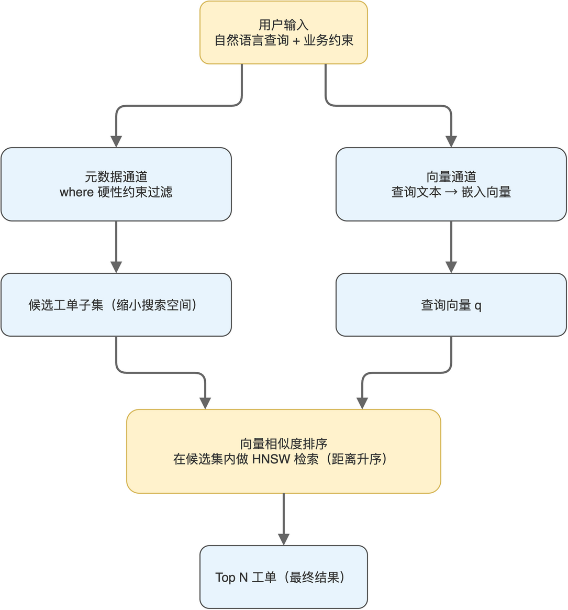

# 第06章 构建工单知识库

在前面的章节中，笔者把文本切片、向量化、ChromaDB 写入查询的零件逐一调通。本章把这些零件组装到一起，搭建本书贯穿案例的核心：电商工单语义检索知识库。读者将看到一条完整工单从原始字典到向量库的全过程，并理解 ChromaDB 中文档、元数据、向量三者协同的工程细节。

完成本章后，读者将拥有一个可被后续 Agent 工具直接调用的工单语义检索能力，并具备把这一思路迁移到任意业务数据上的方法。

## 6.1 工单数据的结构与建模

工单是一种典型的半结构化数据：它的核心字段是固定的（工单号、客户、类型、状态），但描述部分是自由文本。这种半结构化特征恰好对应 ChromaDB 的设计：固定字段进入元数据用于过滤，自由文本进入文档用于向量化。

### 6.1.1 工单字段的职责划分

配套源码中的工单包含 11 个字段，分别承担不同职责。字段分类与作用“如表6-1”所示。

**表 6-1 工单字段的职责划分**

| 字段 | 类型 | 在向量库中的角色 |
|------|------|----------------|
| ticket_no | string | 唯一 ID |
| customer_name | string | 元数据，可用于按客户过滤 |
| customer_email | string | 元数据，联系方式记录 |
| issue_type | string | 元数据与文档拼接共用 |
| priority | string | 元数据，可用于优先级筛选 |
| status | string | 元数据，可用于状态过滤 |
| subject | string | 文档主体的核心句 |
| description | string | 文档主体的补充说明 |
| created_at | string | 元数据，时间维度 |
| resolved_at | string 或空 | 元数据，处理时长计算 |
| satisfaction_score | int 或空 | 元数据，质量指标 |

读者注意 issue_type、priority、status 这类字段同时出现在元数据与文档文本中：进入元数据是为了支持按条件过滤；拼接到文档文本是为了让向量检索“知道”这些标签词的语义，让查询包含“高优先级退款”这种语义时，能在向量层面命中。

### 6.1.2 元数据与文档的协同检索

ChromaDB 支持向量检索与元数据过滤的组合。先用 where 条件缩小候选集，再在候选集内做向量相似度排序，是工单场景常用的检索模式。检索模式“如图6-1”所示。



笔者建议把这条模式作为构建工单知识库的默认思路：业务上的硬性约束（如只查未解决工单）走元数据过滤，语义层面的相似（如“物流相关投诉”）走向量检索。两者分工清晰，避免把所有判断都压到向量相似度上。

> 注意：ChromaDB 的 where 条件只能在已索引的元数据字段上做精确匹配或简单逻辑组合，复杂查询能力远不如关系数据库，业务上不要把它当全功能 SQL 用。

## 6.2 工单数据的格式化与清洗

把原始工单字典放进 ChromaDB 之前，需要做两件事：把多字段拼成一段语义连贯的文本作为文档主体；把元数据中的空值清理为 ChromaDB 可接受的形式。本节实现这两步。

### 6.2.1 把工单拼成可向量化的文本

format_ticket_text 函数把工单字段按固定模板拼接成一段文本，作为向量化的输入。

```python
def format_ticket_text(ticket: dict) -> str:
    return (
        f"工单号:{ticket['ticket_no']} | "
        f"客户:{ticket['customer_name']} | "
        f"类型:{ticket['issue_type']} | "
        f"优先级:{ticket['priority']} | "
        f"状态:{ticket['status']} | "
        f"主题:{ticket['subject']}"
        f"{(' | 描述:' + ticket['description']) if ticket.get('description') else ''}"
    )
```

拼接顺序经过权衡：把工单号放最前便于人眼定位，把类型、优先级、状态等结构标签放前段，让嵌入模型在编码时优先考虑这些语义标签；最后是主题与描述这两条自由文本，承担最主要的语义负载。读者可以根据自己的业务调整字段顺序，但同一个项目中应保持一致，避免向量空间漂移。

### 6.2.2 清理元数据中的空值

ChromaDB 不接受 None 作为元数据值，原始工单中 resolved_at 与 satisfaction_score 可能为空，需要做一次清洗。

```python
def clean_metadata(ticket: dict) -> dict:
    cleaned = {}
    for key, value in ticket.items():
        if value is None:
            cleaned[key] = ""
        else:
            cleaned[key] = value
    return cleaned
```

把 None 统一替换为空字符串是一种简单的兜底策略。读者也可以按字段类型选择不同的占位值，例如把空时间戳替换为远未来的字符串以便后续 SQL 风格的范围比较，但要在元数据 Schema 文档中明确记录占位语义，避免数据消费者误读。

> 注意：ChromaDB 元数据值仅支持 string、int、float、bool 四种类型，把列表或嵌套字典塞进去会在写入时抛错，需要先序列化为字符串。

### 6.2.3 文档与元数据的对照

读者可能会疑问：既然字段已经塞进了元数据，为什么还要在文档中拼一遍？这是因为元数据只用于精确匹配，向量检索完全不感知元数据内容。让 issue_type 这类标签词出现在文档文本里，是为了让“高优先级退款投诉”这种自然语言查询能通过向量相似度命中“issue_type=退款申请, priority=high”的工单。

笔者将这种“双重存储”称为标签词的双通道暴露：通过元数据通道接受精确过滤，通过文档通道接受语义检索。代价是数据冗余，收益是检索表达力。

## 6.3 初始化样本数据并写入向量库

理解了格式化与清洗逻辑之后，整个知识库的初始化就是顺着工单列表逐条调用 Ollama 嵌入接口，再写入 ChromaDB 集合。本节按 init_sample_data 的实现走一遍。

### 6.3.1 集合的创建与幂等

ChromaDB 持久化客户端在指定目录下管理集合，集合不存在时创建、存在时取回。

```python
import chromadb
from pathlib import Path

CHROMA_DB_PATH = Path("./chroma_db")
CHROMA_DB_PATH.mkdir(exist_ok=True)

chroma_client = chromadb.PersistentClient(path=str(CHROMA_DB_PATH))

try:
    tickets_collection = chroma_client.get_collection("tickets")
except Exception:
    tickets_collection = chroma_client.create_collection(
        name="tickets",
        metadata={"description": "电商工单数据集合，支持向量检索"},
    )
```

代码使用 try 加 except 而非 get_or_create_collection，是为了在第一次创建时附带 metadata 描述。读者也可以直接使用 get_or_create_collection 简化代码，差别仅在元数据描述是否记录。

### 6.3.2 初始化前的幂等检查

如果集合中已有数据，重复初始化会产生重复写入。init_sample_data 用一次 count 调用判断是否需要初始化。

````python
def init_sample_data():
    count = tickets_collection.count()
    if count > 0:
        print(f"ChromaDB 中已有 {count} 条工单数据，跳过初始化")
        return
    # ... 后续是定义 sample_tickets 并逐条写入
````

这种简单的“非空就跳过”策略适合演示数据。生产场景下应按业务键判断是否需要更新，并区分初次写入与增量更新两种路径，避免演示数据被误覆盖。

### 6.3.3 逐条向量化并写入

对每条工单依次完成“拼文本、生成向量、清理元数据、写入集合”四个动作。

```python
for ticket in sample_tickets:
    ticket_text = format_ticket_text(ticket)
    embedding = get_embedding(ticket_text)
    if embedding:
        cleaned_metadata = clean_metadata(ticket)
        tickets_collection.add(
            ids=[ticket["ticket_no"]],
            embeddings=[embedding],
            documents=[ticket_text],
            metadatas=[cleaned_metadata],
        )
        print(f"{ticket['ticket_no']}: {ticket['subject'][:30]}...")
    else:
        print(f"{ticket['ticket_no']}: 嵌入失败")
```

读者从这段代码中可以提炼出一条通用模式：向量化失败时不要让整批数据写入中断，而是记录失败工单号，等批次结束后单独重试。生产环境里 Ollama 偶发的连接抖动或模型未加载情况下，这种宽容写入比一处出错全部回滚更实用。

> 注意：ChromaDB 的 add 在 id 已存在时会抛错，需要更新数据时应使用 upsert 方法，或者先 delete 再 add。

## 6.4 检索接口的封装与返回结构

数据进库后，下一步是把检索能力封装成清晰的接口。本节实现的 search_tickets_semantic 既会出现在本章中作为业务函数，也会在下一章作为 MCP Tool 暴露给 Agent。

### 6.4.1 检索函数的核心逻辑

检索函数接收自然语言查询与返回条数，内部完成查询向量化、ChromaDB 查询、结果格式化。

````python
def search_tickets_semantic(query: str, n_results: int = 5) -> str:
    query_embedding = get_embedding(query)
    if not query_embedding:
        return json.dumps({"error": "生成查询向量失败"}, ensure_ascii=False)

    results = tickets_collection.query(
        query_embeddings=[query_embedding],
        n_results=n_results,
        include=["metadatas", "documents", "distances"],
    )
    # ... 后续是格式化为统一结构
````

include 字段显式指定需要返回哪几列，省略时 ChromaDB 默认返回 metadatas、documents、distances，但显式写出更利于维护，避免库版本升级后默认值变化。

### 6.4.2 距离到相似度的换算

ChromaDB 返回的是距离值，距离越小越相似。把它转换为习惯的相似度分数（越接近 1 越相似），便于上层业务理解。

```python
for i, ticket_id in enumerate(results["ids"][0]):
    ticket = results["metadatas"][0][i]
    distance = results["distances"][0][i]
    document = results["documents"][0][i]
    search_results.append({
        "ticket_no": ticket_id,
        "customer_name": ticket.get("customer_name", ""),
        "issue_type": ticket.get("issue_type", ""),
        "priority": ticket.get("priority", ""),
        "status": ticket.get("status", ""),
        "subject": ticket.get("subject", ""),
        "description": ticket.get("description", ""),
        "created_at": ticket.get("created_at", ""),
        "similarity_score": round(1 - distance, 4),
        "matched_text": document[:100] + "..." if len(document) > 100 else document,
    })
```

similarity_score 使用 1 减距离的简单变换，对归一化向量来说这是合理的近似，但严格意义上距离与相似度并不互为简单反函数。读者如果需要把分数做精确门限判断，应改用 numpy 直接计算余弦相似度，或在写入时记录向量并在查询后二次计算。

### 6.4.3 返回结构的设计原则

检索接口返回 JSON 字符串而非 Python 字典，是为了适配后续 MCP Tool 协议要求。设计返回结构时遵循三个原则：包含原始查询用于调试、显式给出结果数量便于上层判空、每条结果包含足够信息让模型不必再次查表。返回 JSON 的字段结构“如表6-2”所示。

**表 6-2 工单检索返回 JSON 的字段结构**

| 字段 | 类型 | 作用 |
|------|------|------|
| query | string | 原始查询语句，便于调试 |
| total_results | int | 返回结果数量 |
| results | array | 工单列表，每项为单条工单的完整摘要 |

让 LLM 直接消费这个结构是设计上的关键：模型看到一份带相似度分数、状态、优先级、主题描述的工单清单时，可以直接做出“哪些与用户问题相关、应给出什么建议”的判断，无需再调用其他工具补充信息。

> 注意：JSON 字符串中需要保证 ensure_ascii=False，否则中文会被转义为 \\uXXXX 形式，影响后续 prompt 的可读性与 token 占用。

## 6.5 本章小结

本章把工单数据从原始字典走到向量库，再以一个语义检索接口呈现给上层。其中三个工程细节值得读者带走：标签词在元数据与文档中双通道暴露、空值在写入前显式占位、检索返回结构包含足够信息让 LLM 自给自足。

到此为止，知识库已经具备完整能力。但是 search_tickets_semantic 当下还是一个普通 Python 函数，只能被同进程的代码调用，无法被 Agent 跨进程调用。下一章笔者将把它升级为一个 MCP Tool，让外部的 Agent 或后端服务能通过标准协议调用这个检索能力。

本章配套源码：https://github.com/kang-airtc/agent-ollama-book
