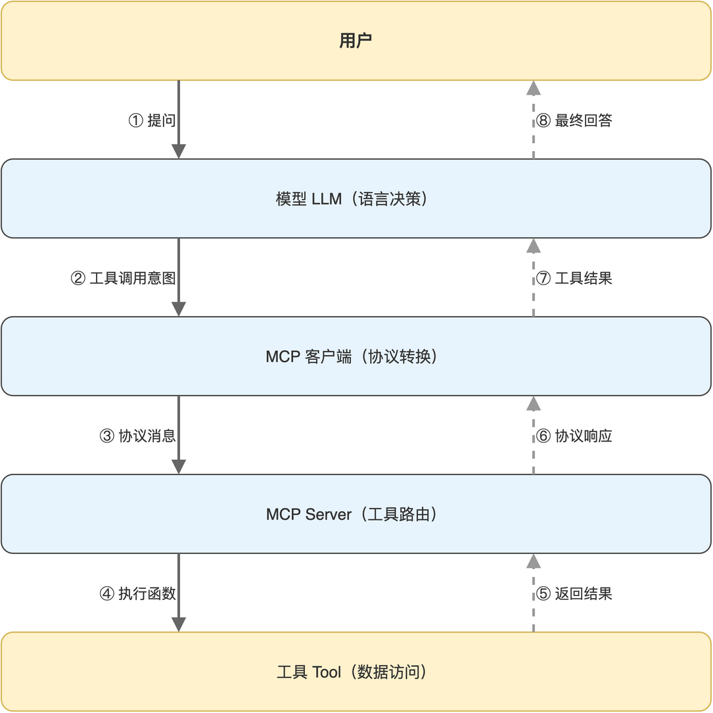

# 第07章 FastMCP 把检索封装成 Agent 工具

工单知识库已经能在 Python 进程内被普通函数调用，但要让外部 Agent、Web 后端或其他语言的客户端使用这份能力，函数级别的接口不够：缺少协议、缺少描述、缺少跨进程通讯。MCP（Model Context Protocol）正是为这种场景设计的标准化协议，它把工具的描述、参数、返回值与传输层一并标准化，便于 Agent 自动发现和调用。

本章用 FastMCP 把上一章的语义检索函数变成一个标准 MCP Tool，并在另一进程里写客户端验证调用。完成本章后，读者将理解 MCP 的核心概念，并能把任意 Python 函数升级为可被 Agent 直接消费的工具。

## 7.1 MCP 协议与 FastMCP

理解 MCP 之前，读者只需要知道它解决的核心问题：让大语言模型在对话过程中按需调用外部工具，并以一致方式获取工具返回的结构化数据。FastMCP 是 Python 生态中实现这一协议的轻量框架。

### 7.1.1 MCP 的角色与传输方式

一次完整的 MCP 调用涉及三方：用户、模型、工具。三方协作过程“如图7-1”所示。



读者从图中可以看到，模型并不直接执行工具，而是产出“我想调用工具 X，参数是 Y”的意图，由 MCP 客户端把意图转换为标准协议消息发送给 MCP Server，再把工具的结果回填给模型继续生成回答。这种分工让模型只负责语言层面的决策，工具只负责确定性的数据访问。

MCP 协议在传输层支持多种方式，包括 stdio、Server-Sent Events 与最新的 streamable HTTP。FastMCP 默认推荐 streamable HTTP，本书也采用这一方式，便于把 MCP Server 放在独立进程或独立服务器上。

### 7.1.2 FastMCP 的核心抽象

FastMCP 把 MCP 协议中的概念抽象为几个 Python 对象，常见抽象与作用“如表7-1”所示。

**表 7-1 FastMCP 的核心抽象**

| 抽象 | 在 MCP 协议中的对应 | 在 Python 中的体现 |
|------|-------------------|------------------|
| FastMCP 实例 | Server | 一个 MCP 服务进程 |
| @mcp.tool 装饰器 | Tool 注册 | 把普通函数注册为可被发现的工具 |
| 函数签名 | Tool 描述与参数 | 类型注解与 docstring 自动生成 Schema |
| 函数返回值 | Tool 响应 | 字符串或结构化内容 |

FastMCP 充分利用 Python 类型注解与 docstring：函数签名映射为工具参数 Schema，docstring 映射为工具描述。这种“代码即文档”的方式让维护成本接近写一个普通函数。

> 注意：FastMCP 自动生成的 Tool Schema 基于类型注解，缺少注解会导致模型看不到参数类型，影响调用准确度，建议所有工具参数都标注类型与默认值。

## 7.2 把检索函数注册为 MCP Tool

上一章实现的 search_tickets_semantic 已经是合适的工具形态：输入自然语言查询、输出 JSON 字符串。本节给它加上 @mcp.tool 装饰器，让 FastMCP 接管协议层。

### 7.2.1 FastMCP 实例与工具注册

只需要两个动作：实例化 FastMCP，把函数加上 @mcp.tool 装饰器即可。

````python
from fastmcp import FastMCP

mcp = FastMCP("电商工单向量检索服务-HTTP")

@mcp.tool()
def search_tickets_semantic(query: str, n_results: int = 5) -> str:
    """
    语义搜索工单 - 使用向量相似度

    Args:
        query: 搜索查询（自然语言描述）
        n_results: 返回结果数量，默认5条
    """
    # ... 与上一章相同的检索实现
````

读者注意 docstring 的写法：函数主要描述写在第一行，Args 段落按 Google 风格列出每个参数的含义。FastMCP 把这些信息自动转换为 MCP 协议中的 Tool 描述，模型在决定是否调用工具时正是依据这些描述判断的。

### 7.2.2 第二个工具：重建向量库

工具的颗粒度建议按业务动作划分，而非按数据表划分。除了语义检索，再注册一个重建向量库的工具，便于运维场景下让 Agent 一句话触发数据重建。

```python
@mcp.tool()
def rebuild_vector_store() -> str:
    """重建向量库（清空后重新初始化示例数据）"""
    try:
        all_ids = tickets_collection.get()["ids"]
        if all_ids:
            tickets_collection.delete(ids=all_ids)

        init_sample_data()

        return json.dumps({
            "success": True,
            "message": f"向量库重建完成，当前共 {tickets_collection.count()} 条数据",
        }, ensure_ascii=False)
    except Exception as e:
        return json.dumps({"error": f"重建失败: {str(e)}"}, ensure_ascii=False)
```

两个工具一个偏读、一个偏写，覆盖了知识库的最小可用工具集。后续如果有按工单号查询、按状态筛选等需求，按相同模式注册即可。

> 注意：MCP 工具的副作用（写库、重建）应在返回值中明确说明执行结果，不要依赖异常退出告诉模型“出错了”，模型对 JSON 内容的解读能力远好于堆栈跟踪。

### 7.2.3 启动 MCP Server

把以上代码与初始化逻辑组装到一起，启动一个 streamable HTTP 模式的 MCP Server。

```python
if __name__ == "__main__":
    init_sample_data()

    print("\n启动电商工单向量检索 MCP Server...")
    print("服务端点: http://localhost:8001/mcp")
    print("\n提供工具:")
    print("  • search_tickets_semantic - 语义搜索（向量检索）")
    print("  • rebuild_vector_store - 重建向量库")

    mcp.run(transport="streamable-http", port=8001, path="/mcp")
```

mcp.run 接收三个关键参数：transport 指定传输协议、port 指定端口、path 指定路径。streamable HTTP 把 MCP 协议消息封装在 HTTP 流式请求里，与本书后端的 SSE 思路是同一族，便于跨语言客户端接入。

启动后服务在 localhost:8001/mcp 监听，整个服务进程的能力清单与端点关系“如表7-2”所示。

**表 7-2 MCP Server 的访问端点与工具清单**

| 端点 | 作用 | 调用方式 |
|------|------|---------|
| http://localhost:8001/mcp | MCP 协议入口 | 通过 MCP 客户端发起 streamable HTTP 调用 |
| search_tickets_semantic | 语义检索工具 | 客户端通过 call_tool 调用 |
| rebuild_vector_store | 重建向量库工具 | 客户端通过 call_tool 调用 |

读者可以把 MCP Server 想象成一台微型 REST 服务，区别在于它不暴露任意自定义路径，所有调用都走 /mcp 入口、由协议字段区分目的。

## 7.3 用 MCP 客户端调用工具

服务端就绪后，客户端的工作很简单：建立 streamable HTTP 连接、初始化会话、按工具名调用、解析返回内容。本节用 agent_client.py 中的实现展开讲解。

### 7.3.1 建立会话并调用工具

MCP 客户端的核心动作是 ClientSession.call_tool。它接收工具名与参数字典，返回结构化结果。

```python
import asyncio
import json
from mcp import ClientSession
from mcp.client.streamable_http import streamable_http_client

async def call_agent_tool(tool_name: str, arguments: dict = None):
    if arguments is None:
        arguments = {}

    async with streamable_http_client(url="http://localhost:8001/mcp") as (
        read,
        write,
        _session_id_callback,
    ):
        async with ClientSession(read, write) as session:
            await session.initialize()
            result = await session.call_tool(tool_name, arguments)
            for content in result.content:
                if content.type == "text":
                    return content.text
            return json.dumps({"error": "No text content in result"})
```

代码使用嵌套的 async with，外层管理传输连接，内层管理会话生命周期。session.initialize 是 MCP 协议规定的握手动作，必须在 call_tool 之前调用。

result.content 是一个 list，每项可能是文本、图片、二进制等多种类型；本书的工具只返回文本，所以只需要遍历找到第一个 type == “text” 的内容即可。

### 7.3.2 包装常用工具的便捷函数

每次调用都要写工具名和参数字典容易出错，建议为每个工具包一个便捷函数。

```python
async def call_search_tickets_semantic(query: str, n_results: int = 5):
    return await call_agent_tool(
        "search_tickets_semantic",
        {"query": query, "n_results": n_results},
    )
```

便捷函数的好处不仅是代码简洁，更重要的是把工具名与参数 schema 集中在一处管理：将来工具签名变化时只需要改这一个函数，业务代码无感知。

### 7.3.3 客户端联调验证

把 agent_client.py 单独作为脚本运行，可以快速验证 MCP Server 是否可用。

```python
if __name__ == "__main__":
    async def test():
        print("测试语义搜索...")
        result = await call_search_tickets_semantic("退款问题", 3)
        print(result)

    asyncio.run(test())
```

读者先启动 agent_server.py，再运行 agent_client.py，应能看到返回的 JSON 字符串中包含三条与退款相关的工单。整条链路从客户端发起、经 MCP 协议、进入向量检索、回到客户端，跑通即说明 MCP 工具封装成功。

> 注意：streamable_http_client 与 ClientSession 都是异步上下文管理器，必须在 async 函数中使用，写到同步代码里会立即抛错。

## 7.4 工具设计的几条经验

把函数变成 MCP Tool 不只是加装饰器那么简单，工具的命名、返回结构、错误处理直接影响 Agent 调用质量。本节小结几条来自本书项目的经验。

### 7.4.1 工具名与描述的可读性

工具名既给程序看也给模型看。命名应满足两个要求：动词在前突出动作意图，名词在后明确操作对象。本书 search_tickets_semantic 即“搜索-工单-语义”，rebuild_vector_store 即“重建-向量-库”，模型从工具名就能理解功能。

描述（来自 docstring）应包含三个层面信息：功能一句话总结、典型适用场景、参数含义。模型在多个相似工具间做选择时，主要靠描述区分。

### 7.4.2 返回值结构的稳定

JSON 返回值的字段名应保持稳定，模型一旦学会某个工具的返回结构，后续调用都会按此结构解析。新增字段是安全的、修改或删除字段则可能破坏已写好的提示模板，应通过版本字段或新增工具等方式向后兼容。

### 7.4.3 错误的显式表达

Python 异常在 MCP 调用链中可能被吞掉或转成模型不易理解的形式。建议工具内部捕获异常，把错误转为标准 JSON 字段。

```python
return json.dumps({"error": f"搜索失败: {str(e)}"}, ensure_ascii=False)
```

模型看到 error 字段后会自然采取重试或降级策略，远好于面对空白响应或 500 错误时的无所适从。

## 7.5 本章小结

本章把语义检索能力从普通 Python 函数升级为 MCP Tool，并实现了对应的客户端封装。读者现在掌握的不仅是 FastMCP 用法，更是一种通用的“工具化”思路：把确定性的数据访问能力沉淀为标准工具，让模型只承担语言决策。

接下来的工作是把 MCP 客户端嵌入到完整后端服务里，给前端用户提供一个体验流畅的流式问答接口。下一章笔者将搭建 FastAPI 服务，串起向量检索、RAG 提示工程、Ollama 流式生成、SSE 推流四个环节，把链路推进到面向用户的最后一公里。

本章配套源码：https://github.com/kang-airtc/ollama-mini-book
