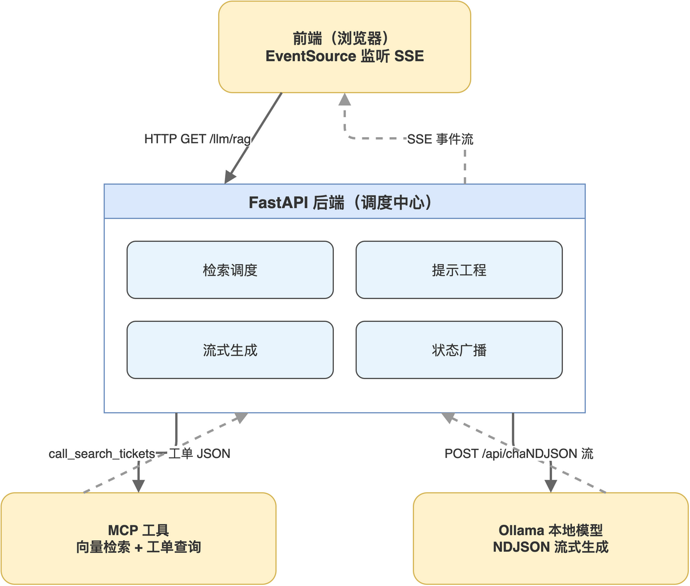

# 第08章 FastAPI 与 SSE 流式 RAG 后端

到目前为止，知识库、检索工具、MCP 客户端都已经就绪，但仍缺少一个面向最终用户的入口。本章用 FastAPI 把整条 RAG 链路串起来：接收前端发来的自然语言问题，调用 MCP 工具检索相关工单，构造检索增强提示词喂给 Ollama，再用 SSE 把模型的流式回答推送到前端。

完成本章后，读者将拥有一个可被任意前端调用的 /llm/rag 接口，并理解 SSE 协议为何特别适合本地 LLM 这种“边算边出”的场景。

## 8.1 后端在 RAG 链路中的职责

后端在 RAG 链路中不只是简单的转发，它需要承担四个职责：检索调度、提示工程、流式生成、状态广播。完整链路与后端在其中的位置“如图8-1”所示。



读者从图中可以看到，后端是唯一同时与三方通讯的角色：向上对前端推送状态与回答，向下调用 MCP 工具获取数据，横向调用 Ollama 完成生成。把这四件事用一个 FastAPI 应用统一编排，可以让职责清晰、错误集中处理。

### 8.1.1 SSE 协议的适配性

Server-Sent Events 是一种基于 HTTP 的单向流式协议：服务器持续向客户端推送事件，客户端通过 EventSource API 监听。SSE 与 WebSocket、HTTP 流式响应的差异“如表8-1”所示。

**表 8-1 SSE 与其他流式协议的差异**

| 协议 | 通讯方向 | 浏览器原生 API | 自动重连 | 适合场景 |
|------|---------|--------------|---------|---------|
| SSE | 服务器到客户端单向 | EventSource | 内置 | 模型流式输出、状态推送 |
| WebSocket | 双向 | WebSocket | 需手动实现 | 双向实时通讯，如聊天室 |
| HTTP 流式 | 服务器到客户端单向 | fetch 加流式读取 | 无 | 需要自定义协议时 |

本书选用 SSE，是因为它对前端友好（EventSource 自动断线重连）、对服务端轻量（标准 HTTP 流）、对 LLM 输出形态匹配（一段段文本增量推送）。

### 8.1.2 FastAPI 与 sse-starlette 的搭配

FastAPI 本身不直接提供 SSE 响应，常见做法是引入 sse-starlette 提供 EventSourceResponse 与 ServerSentEvent 两个类。前者把异步生成器转为 SSE 响应，后者承载单个事件。

> 注意：从 FastAPI 路由函数返回 EventSourceResponse 时，函数体应是 async 生成器（含 yield），而非直接返回值，否则前端只会收到完整响应而非流式分段。

## 8.2 服务骨架与 CORS 配置

后端代码集中在 backend/main.py，本节先看应用初始化与跨域处理，这是任何前后端分离项目都绕不开的两件事。

### 8.2.1 应用初始化与中间件

FastAPI 应用的基础初始化与 Ollama 配置加载放在文件顶部。

```python
import os
from fastapi import FastAPI
from fastapi.middleware.cors import CORSMiddleware
from fastapi.responses import EventSourceResponse
from fastapi.sse import ServerSentEvent
from dotenv import load_dotenv

load_dotenv()

OLLAMA_BASE_URL = os.getenv("OLLAMA_BASE_URL", "http://localhost:11434")
OLLAMA_MODEL = os.getenv("OLLAMA_MODEL", "llama3.2:latest")

app = FastAPI()
```

把 Ollama 的地址与模型名通过环境变量注入，是为了不在代码中写死部署信息。本地开发用 .env 文件、生产环境用容器或编排平台的环境变量注入，调用方式一致。

### 8.2.2 跨域中间件的开放范围

前端 Next.js 默认运行在 3000 端口，后端在 8000 端口，跨域是必经一关。

```python
app.add_middleware(
    CORSMiddleware,
    allow_origins=["http://localhost:3000", "http://127.0.0.1:3000"],
    allow_credentials=True,
    allow_methods=["*"],
    allow_headers=["*"],
)
```

allow_origins 明确列出允许来源，比使用通配符 [“*”] 更安全。生产环境中应改为具体的前端域名，并配合 HTTPS。

> 注意：浏览器对 EventSource 的跨域请求只支持 GET 方法，且不允许自定义请求头，前端无法像普通 fetch 那样附加 Authorization Header；如果需要认证，应通过 URL 参数或 Cookie 传递。

## 8.3 流式 LLM 调用的实现

整条 RAG 链路里 LLM 调用占据最长时间，必须以流式方式输出。本节把第 2 章的 httpx 流式调用进一步打磨为可在生产中使用的版本。

### 8.3.1 异步流式生成器

stream_ollama_llm 接收 prompt，按 NDJSON 协议解析 Ollama 响应，每读到一段 content 就 yield 出去。

```python
async def stream_ollama_llm(prompt: str):
    import httpx

    payload = {
        "model": OLLAMA_MODEL,
        "system": "你是一个专业的电商客服数据分析助手。请根据提供的工单数据进行分析，并给出简洁的总结和建议。",
        "messages": [{"role": "user", "content": prompt}],
        "stream": True,
        "options": {"temperature": 0.7, "num_predict": 2000},
    }

    try:
        async with httpx.AsyncClient(timeout=120.0) as client:
            async with client.stream(
                "POST",
                f"{OLLAMA_BASE_URL}/api/chat",
                json=payload,
            ) as response:
                response.raise_for_status()
                async for line in response.aiter_lines():
                    line = line.strip()
                    if not line:
                        continue
                    try:
                        chunk = json.loads(line)
                        if chunk.get("done", False):
                            break
                        message = chunk.get("message", {})
                        content = message.get("content", "")
                        if content:
                            yield content
                    except json.JSONDecodeError:
                        continue
    except httpx.HTTPError as e:
        yield f"HTTP 错误: {str(e)}"
```

代码中三处防御值得读者留意：跳过空行避免触发 JSONDecodeError、捕获 JSONDecodeError 后 continue 而非 break、把 HTTP 错误也作为 yield 输出而非抛异常。前两条让单行损坏不影响整段生成，第三条让前端能在体验上感知错误而不是莫名其妙地停在某处。

### 8.3.2 system 提示与生成参数

payload 中的 system 字段约束模型扮演的角色，options 中的 temperature 与 num_predict 控制生成行为。本书常用值与含义“如表8-2”所示。

**表 8-2 Ollama 生成参数的常用设置**

| 参数 | 含义 | 本书取值 |
|------|------|---------|
| temperature | 采样随机性 | 0.7 兼顾确定性与表达力 |
| num_predict | 最大生成 token 数 | 2000 满足典型工单分析长度 |
| top_p | 核采样阈值 | 默认 0.9，不显式设置 |
| stop | 停止符 | 暂未使用 |

笔者建议把生成参数集中到一个 dict 中按场景命名管理（如 ANALYSIS_OPTIONS、SUMMARY_OPTIONS），避免在多个调用点散落配置。

## 8.4 RAG 端点的完整编排

主路由 /llm/rag 把检索、提示构造、模型调用、状态推送串成一条异步生成器。本节按阶段拆解。

### 8.4.1 阶段一：参数校验与状态广播

接收查询参数后立即给前端一个状态事件，让用户感知请求已被接收。

```python
@app.get("/llm/rag", response_class=EventSourceResponse)
async def rag_stream(query: str = "", n_results: int = 5):
    if not query:
        yield ServerSentEvent(event="error", data={"message": "查询内容不能为空"})
        return

    yield ServerSentEvent(
        event="status",
        data={"message": f"正在分析问题: {query[:50]}..."},
    )
    await asyncio.sleep(0.3)
```

status 事件用于推送进度提示，前端可据此渲染加载指示。短暂 sleep 是为了避免阶段切换过快造成“看不到状态”的体验。

### 8.4.2 阶段二：调用 MCP 检索工单

通过上一章实现的 call_search_tickets_semantic 拿到相关工单。

```python
yield ServerSentEvent(event="status", data={"message": "正在进行语义检索..."})

search_result = await call_search_tickets_semantic(query, n_results)
search_data = json.loads(search_result)

total_results = search_data.get("total_results", 0)

if total_results == 0:
    yield ServerSentEvent(event="status", data={"message": "未找到相关工单，将基于通用知识回答"})
    relevant_tickets = []
else:
    yield ServerSentEvent(
        event="status",
        data={"message": f"检索到 {total_results} 条相关工单"},
    )
    relevant_tickets = search_data.get("results", [])
    yield ServerSentEvent(
        event="retrieved_data",
        data={"total": total_results, "tickets": relevant_tickets},
    )
```

retrieved_data 事件把检索到的工单提前推给前端，前端可在 LLM 还在生成时先把“参考来源”区域渲染出来，让用户感知信息来源。

### 8.4.3 阶段三：构造提示词

提示词是 RAG 的核心，工程上需要“约束格式、限定能力边界、给出回答结构”。本书的提示模板分两套：检索到工单时用 RAG 模板，检索为空时用兜底模板。

RAG 模板的关键片段如下：

```python
tickets_text = "\n\n".join([
    f"【工单 {i + 1}】(相关度: {t.get('similarity_score', 0):.1%})\n"
    f"工单号: {t['ticket_no']}\n"
    f"客户: {t['customer_name']}\n"
    f"类型: {t['issue_type']}\n"
    f"优先级: {t['priority']}\n"
    f"状态: {t['status']}\n"
    f"主题: {t['subject']}\n"
    f"描述: {t.get('description', '无')}"
    for i, t in enumerate(relevant_tickets)
])

prompt = f"""你是电商客服数据分析专家。请根据以下检索到的相关工单，回答用户的问题。

用户问题：
{query}

检索到的相关工单（共 {total_results} 条）：
{tickets_text}

请按以下格式回答：
1. 直接回答
2. 相关工单分析
3. 建议措施
"""
```

提示词的设计要点：把用户问题与检索到的工单都标记清楚、要求模型按固定结构输出、对数据不足的情况主动表态。结构化输出便于前端做样式化渲染，也便于后续接入更精细的解析逻辑。

> 注意：提示词长度直接影响生成速度与上下文占用，本地模型上下文有限，工单条数过多时应在检索阶段截断，而非塞进提示词后让模型自行忽略。

### 8.4.4 阶段四：流式生成与 SSE 推送

把模型输出的每个文本片段封装为 llm_chunk 事件推送给前端。

```python
yield ServerSentEvent(event="status", data={"message": "正在生成回答..."})

async for chunk in stream_ollama_llm(prompt):
    yield ServerSentEvent(event="llm_chunk", data={"content": chunk})

yield ServerSentEvent(event="status", data={"message": "回答完成！"})
```

事件类型按职责分工：llm_chunk 承载生成文本、status 承载阶段提示、retrieved_data 承载检索结果、error 承载错误。前端按事件类型分别处理，结构清晰。

## 8.5 错误处理与超时

后端在调度模型与外部服务时最容易因外部依赖故障而长时间无响应，必须显式处理三类异常：MCP 调用失败、Ollama 调用失败、客户端断连。

### 8.5.1 把异常转为 SSE error 事件

外层用 try/except 把任意异常转换为 error 事件，避免连接被静默断开。

````python
try:
    # 检索、构造提示词、流式生成
    ...
except Exception as e:
    yield ServerSentEvent(
        event="error",
        data={"message": f"RAG 处理失败: {str(e)}"},
    )
````

读者可以根据需要细化异常类型分类，比如 ConnectionError 单独提示用户检查 Ollama 是否启动、TimeoutError 单独提示重试。

### 8.5.2 任务取消的处理

前端用户关闭页面时，浏览器会断开 SSE 连接，FastAPI 会在生成器中抛 asyncio.CancelledError。这一异常无需手动捕获，框架会自动结束生成器，httpx 流也会一并关闭，最终 Ollama 端的生成也会被取消。

> 注意：避免在 except Exception 中吞掉 CancelledError，否则取消机制失效，会出现“用户已断开但服务器还在生成”的资源泄露。

## 8.6 本章小结

本章把 FastAPI 后端从空白搭建到完整可用：跨域配置、httpx 流式调用、MCP 客户端集成、SSE 事件分类、错误兜底逐一到位。读者现在掌握的是一种通用的 RAG 后端模板，把工单数据换成产品知识库、客户档案、技术文档，整套链路结构几乎不变。

接下来的工作是让前端用户能用上这套能力。下一章笔者将基于 Next.js 实现一个流式聊天界面，把 SSE 事件按类型渲染为状态提示、参考来源与回答内容。

本章配套源码：https://github.com/kang-airtc/agent-ollama-book
