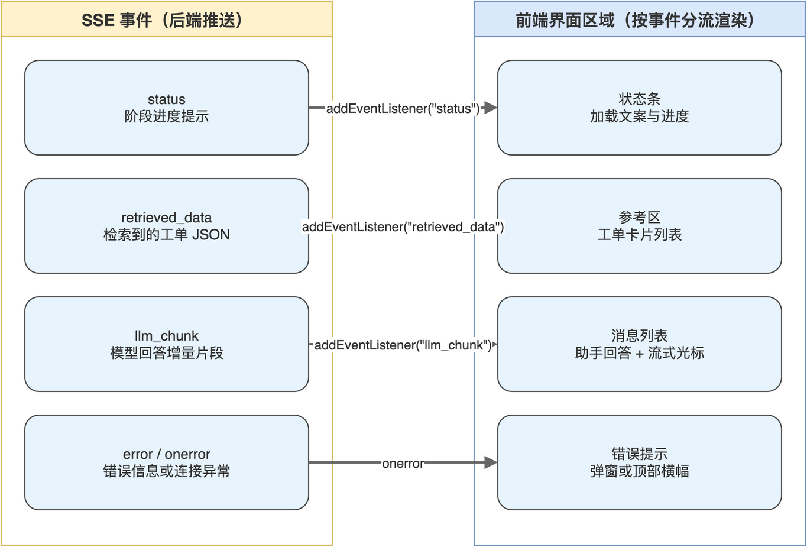

# 第09章 Next.js 前端流式聊天界面

后端已经把 RAG 能力打包成一个 SSE 接口，最后一公里是让最终用户在浏览器中流畅地体验它。本章用 Next.js 实现一个最小可用的流式聊天界面：把用户问题通过 EventSource 发给后端，按事件类型把检索状态、参考工单与模型回答分别渲染出来。

完成本章后，读者将拥有一个能跑通的电商工单问答前端，并理解 EventSource API 如何把 SSE 协议消化为浏览器中熟悉的事件回调。

## 9.1 前端在 RAG 链路中的责任

前端在本书项目里承担三件事：把用户输入打包为查询参数发起请求、按事件类型分流渲染、维护对话历史。其中事件分流是最值得展开的部分，它决定了用户感知到的“加载提示、参考来源、回答内容”是否清晰。事件分流与界面区域的对应关系“如图9-1”所示。



读者可以把整个前端的工作压缩为一句话：把后端推过来的 SSE 事件按 type 字段分发到不同的界面区域。这也是 EventSource API 与 fetch 流式读取相比最大的优势：原生支持事件名，前端代码只需 addEventListener 即可分类处理。

### 9.1.1 EventSource API 的工作方式

EventSource 是浏览器原生提供的 SSE 客户端，特征包括：自动建立长连接、断线自动重连、按事件名注册回调。常用 API 与作用“如表9-1”所示。

**表 9-1 EventSource API 的常用成员**

| 成员 | 类型 | 作用 |
|------|------|------|
| new EventSource(url) | 构造 | 建立 SSE 连接，自动发起 GET 请求 |
| addEventListener(name, fn) | 方法 | 监听后端推送的具名事件 |
| onmessage | 属性 | 监听默认事件，即未指定 event 字段时 |
| onerror | 属性 | 监听连接错误，自动触发重连 |
| close() | 方法 | 主动关闭连接，停止接收事件 |

后端发送的每条 SSE 消息可包含 event 字段标记事件名，前端用 addEventListener 按事件名分别处理，让代码不需要 if/else 判断事件类型。

> 注意：EventSource 只支持 GET 请求且不能发送自定义请求头，前端无法把查询语句放进请求体，必须通过 URL 查询参数传递，且需要 encodeURIComponent 处理特殊字符。

### 9.1.2 React 状态管理的最小集

聊天界面的状态可以归纳为三组：消息列表、输入框内容、加载状态。本书使用 React 内置的 useState 即可，不需要引入 Redux 或其他状态管理库。

```tsx
interface Message {
  id: number;
  role: "user" | "assistant";
  content: string;
  timestamp: string;
  isStreaming?: boolean;
}

const [messages, setMessages] = useState<Message[]>([]);
const [inputValue, setInputValue] = useState("");
const [isLoading, setIsLoading] = useState(false);
```

isStreaming 标记是为了让 UI 在助手消息流式更新过程中显示打字光标或加载点，结束后切回静态状态。

## 9.2 发起 SSE 请求与事件订阅

本节实现 handleSend 函数，它是用户点击发送按钮后的核心动作。逻辑包含追加消息、创建 EventSource、注册事件回调三个步骤。

### 9.2.1 追加用户消息与助手占位

在发起请求前先把用户消息与助手消息占位都加入列表，避免出现“用户消息已显示但助手区域空白”的视觉断层。

```tsx
const handleSend = () => {
  if (!inputValue.trim() || isLoading) return;

  const userMessage: Message = {
    id: Date.now(),
    role: "user",
    content: inputValue.trim(),
    timestamp: new Date().toLocaleTimeString(),
  };
  setMessages((prev) => [...prev, userMessage]);
  setInputValue("");
  setIsLoading(true);

  const assistantMessageId = Date.now() + 1;
  const assistantMessage: Message = {
    id: assistantMessageId,
    role: "assistant",
    content: "",
    timestamp: new Date().toLocaleTimeString(),
    isStreaming: true,
  };
  setMessages((prev) => [...prev, assistantMessage]);
};
```

每条消息的 id 使用 Date.now()，足以应对单人单会话场景。多用户协同或离线缓存场景下应改用 UUID 或服务端下发 ID 以保证全局唯一。

### 9.2.2 建立 EventSource 与查询参数

把用户问题通过 URL 查询参数传给后端，注意做 URI 编码。

```tsx
const encodedQuery = encodeURIComponent(userMessage.content);
const es = new EventSource(
  `http://localhost:8000/llm/rag?query=${encodedQuery}&n_results=5`,
);
eventSourceRef.current = es;
```

eventSourceRef 是一个 useRef 持有的引用，作用是让后续的 cleanup 与重发请求都能拿到当前连接的句柄。每次发送新消息时先关闭旧连接，避免事件回调残留到下一次会话。

> 注意：EventSource 默认带凭据策略是 omit，跨域请求不会带 Cookie，需要鉴权时应在构造时传入第二参数 { withCredentials: true }，并在后端 CORS 配置中允许凭据。

### 9.2.3 监听三类核心事件

按事件名分别注册回调，处理状态、检索结果与流式回答。

```tsx
es.addEventListener("status", (e) => {
  try {
    const data = JSON.parse(e.data);
    console.log("Status:", data.message);
  } catch (err) {
    console.error("Parse status error:", e.data);
  }
});

es.addEventListener("retrieved_data", (e) => {
  try {
    const data = JSON.parse(e.data);
    console.log("Retrieved:", data.total, "tickets");
  } catch (err) {
    console.error("Parse retrieved_data error:", e.data);
  }
});
```

最关键的是 llm_chunk 事件，它承载真正的文本增量，前端需要累加 content 并把对应助手消息更新到 UI。

```tsx
let fullContent = "";

es.addEventListener("llm_chunk", (e) => {
  try {
    const data = JSON.parse(e.data);
    if (data.content) {
      fullContent += data.content;
      setMessages((prev) =>
        prev.map((msg) =>
          msg.id === assistantMessageId
            ? { ...msg, content: fullContent }
            : msg,
        ),
      );
    }
  } catch (err) {
    console.error("Parse llm_chunk error:", e.data);
  }
});
```

fullContent 作为闭包变量积累文本，每次到达增量片段就 setMessages 触发重渲染。读者要注意 setMessages 内部用 prev 加 map 写法而非直接赋值，是为了在 React 的状态更新批处理中保持引用稳定。

## 9.3 渲染状态与结束处理

事件订阅之后，需要一些 UI 层细节让体验完整：流式过程中的打字指示、结束后的清理、错误兜底。本节给出对应实现。

### 9.3.1 流式结束的标记

后端在最后一条 status 事件中包含“回答完成”字样，前端可借此把 isStreaming 切回 false，并关闭 EventSource。

```tsx
es.addEventListener("status", (e) => {
  try {
    const data = JSON.parse(e.data);
    if (data.message && data.message.includes("完成")) {
      setMessages((prev) =>
        prev.map((msg) =>
          msg.id === assistantMessageId
            ? { ...msg, isStreaming: false }
            : msg,
        ),
      );
      setIsLoading(false);
      es.close();
    }
  } catch (err) {
    console.error("Parse completion error:", e.data);
  }
});
```

直接用字符串包含判断不是最优雅，但足够简单稳定。读者也可以约定一个独立的 done 事件类型，前后端各自维护更明确。

### 9.3.2 错误处理

EventSource 自带 onerror 回调，可在连接断开或 HTTP 错误时触发。

```tsx
es.onerror = () => {
  setIsLoading(false);
  setMessages((prev) =>
    prev.map((msg) =>
      msg.id === assistantMessageId
        ? { ...msg, isStreaming: false, content: msg.content || "（连接异常）" }
        : msg,
    ),
  );
  es.close();
};
```

onerror 也是浏览器内部触发自动重连的入口。如果不希望前端在重试时反复弹窗或反复发请求，调用 es.close() 主动断开是最直接的方式。

### 9.3.3 组件卸载时的清理

用户切换页面或刷新时，应释放当前连接，避免后端继续生成无人接收的回答。

```tsx
useEffect(() => {
  return () => {
    if (eventSourceRef.current) {
      eventSourceRef.current.close();
    }
  };
}, []);
```

读者从这里能看到一个通用模式：所有引用了浏览器原生资源（EventSource、WebSocket、定时器）的组件，都应在卸载时显式释放，避免内存泄漏与无效后台流量。

> 注意：开发模式下 React Strict Mode 会让 useEffect 触发两次，可能导致一次连接立刻被关闭再重建。把核心逻辑放在 handleSend 而非 useEffect 中可以避开这一行为带来的困扰。

## 9.4 渲染结构与样式

UI 渲染本身没有 RAG 特有的难点，但有几个值得带走的小习惯，可以让流式体验更顺滑。本节给出关键片段。

### 9.4.1 消息列表的渲染

按 role 渲染不同样式的消息卡片，并用 ref 锚定滚动位置。

```tsx
<div className="messages">
  {messages.map((msg) => (
    <div key={msg.id} className={`msg ${msg.role}`}>
      <div className="content">{msg.content}</div>
      <div className="meta">{msg.timestamp}</div>
      {msg.isStreaming && <span className="cursor">▍</span>}
    </div>
  ))}
  <div ref={messagesEndRef} />
</div>
```

光标符号 ▍ 是常见的流式视觉指示，比起 spinner 更贴合 LLM 的“边输入边显示”形态。读者也可以替换为闪烁的下划线或省略号动画。

### 9.4.2 自动滚动

新消息到来时滚动到列表底部，利用 useEffect 监听 messages 变化。

```tsx
useEffect(() => {
  messagesEndRef.current?.scrollIntoView({ behavior: "smooth" });
}, [messages]);
```

平滑滚动对用户体验更友好，但在长对话场景下可能影响性能，必要时改为 instant 即可。

### 9.4.3 区域划分

完整页面常见的区域划分“如表9-2”所示。

**表 9-2 RAG 聊天页面的常见区域划分**

| 区域 | 主要数据来源 | 渲染内容 |
|------|------------|---------|
| 消息列表 | messages 状态 | 用户与助手消息的对话记录 |
| 输入栏 | inputValue 状态 | 输入框、发送按钮、loading 指示 |
| 状态条 | status 事件 | 当前处理阶段提示 |
| 参考区 | retrieved_data 事件 | 检索到的工单卡片 |

参考区是 RAG 应用区别于普通对话的关键，把检索来源直接展示给用户，可以增加信任感、便于用户对照原始数据自行判断。

## 9.5 本章小结

本章把 Next.js 前端从空白页面推进到可用聊天界面，重点放在 EventSource 与 React 状态的衔接、SSE 事件按类型分流、流式渲染的细节处理。读者掌握的不仅是这个具体页面的实现，更是一种“前端按事件分发渲染”的通用模式。

至此整条 RAG 链路在代码层面已经完整。但要把三个独立服务（MCP Server、FastAPI、Next.js）协同跑起来还有一些工程细节：启动顺序、端口冲突、模型未拉取、依赖缺失等。下一章笔者将系统整理全栈联调与排错经验，让读者在拿到代码后能顺畅地把整个项目跑通。

本章配套源码：https://github.com/kang-airtc/agent-ollama-book
