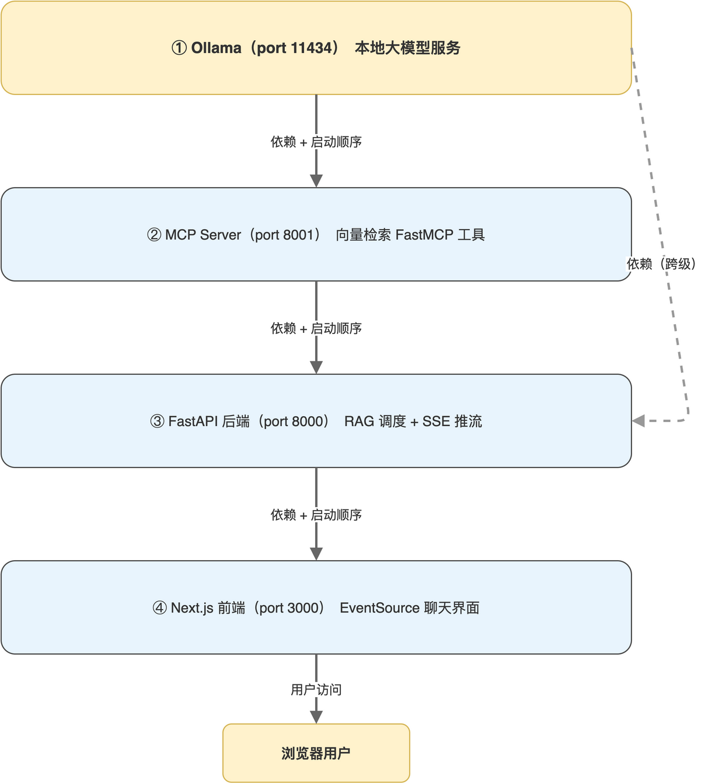

# 第10章 全栈联调与排错

走到本章，读者已经在前面九章里把所有零件分别讲清楚。但分头跑通与整套跑通是两回事：Ollama、MCP Server、FastAPI、Next.js 四个进程需要按正确顺序启动，相互的端口、依赖、模型必须就位。本章把全栈联调的步骤、常见故障、调试技巧一并整理，作为读者跑通本书项目的最后一道指南。

完成本章后，读者将拥有一份可重复使用的本地部署 Checklist，并具备在任意环境下迅速定位 RAG 链路故障的能力。

## 10.1 启动顺序与端口规划

本项目涉及四个独立进程，各自占用不同端口，启动顺序不能乱：上游服务必须先于依赖它的下游服务启动。完整的服务拓扑与启动顺序“如图10-1”所示。



### 10.1.1 各服务的端口与依赖关系

服务的端口分配与上下游依赖“如表10-1”所示。

**表 10-1 RAG 全栈服务的端口与依赖关系**

| 服务 | 端口 | 上游依赖 | 下游消费者 |
|------|------|--------|----------|
| Ollama | 11434 | 无 | MCP Server、FastAPI |
| MCP Server | 8001 | Ollama | FastAPI |
| FastAPI 后端 | 8000 | Ollama、MCP Server | Next.js 前端 |
| Next.js 前端 | 3000 | FastAPI | 浏览器用户 |

读者从表中可以看到，Ollama 是整个链路的根依赖，必须最先启动；MCP Server 与 FastAPI 都直接依赖 Ollama；前端只与 FastAPI 交互，启动顺序最晚。

### 10.1.2 启动命令清单

四个服务的启动命令按顺序整理。

```bash
ollama serve
```

Ollama 默认会被系统服务托管，如果已经在后台运行可跳过这一步。手动启动用于希望观察日志的场景。

```bash
cd agent
source venv/bin/activate
python agent_server.py
```

MCP Server 启动时会先初始化样本数据（如果向量库为空），看到“启动电商工单向量检索 MCP Server...”字样即就绪。

```bash
cd backend
source venv/bin/activate
uvicorn main:app --reload --port 8000
```

FastAPI 后端用 uvicorn 启动，--reload 让代码改动后自动重启，便于开发。生产部署应去掉 --reload 并由 gunicorn 或 systemd 托管。

```bash
cd frontend
npm run dev
```

Next.js 开发服务器默认监听 3000 端口。读者打开浏览器访问 http://localhost:3000 即可进入聊天页面。

> 注意：venv 是各服务各自的虚拟环境，目录互不相同，切换服务时记得先用 deactivate 退出当前环境再激活下一个，避免依赖混用。

## 10.2 联调前的环境检查

每次重新拉取代码或换机器，先按 Checklist 走一遍环境检查，能避免大部分“莫名其妙跑不起来”的问题。

### 10.2.1 Ollama 与模型可用性

执行三条命令逐一确认。

```bash
curl http://localhost:11434
ollama list
ollama run llama3.2 "你好"
```

第一条确认服务可达；第二条确认两个模型都在本地；第三条做一次最小生成验证模型可用。任何一条失败都说明 Ollama 侧有问题，应优先解决。

### 10.2.2 Python 依赖完整性

两个 Python 项目的 requirements.txt 必须分别安装。

```bash
cd agent && pip install -r requirements.txt
cd ../backend && pip install -r requirements.txt
```

如果 pip 安装中报错，常见原因是 Python 版本过低或国内网络拉取 PyPI 失败。本书项目建议 Python 3.10 及以上，网络问题可通过临时切换镜像源解决。

### 10.2.3 Node 依赖与版本

前端项目执行依赖安装与启动前的快速验证。

```bash
cd frontend
npm install
npx next info
```

next info 输出 Node 版本与 Next.js 版本，便于读者确认本地环境与项目期望匹配。Node 版本应不低于 18。

> 注意：Next.js 主版本迭代较快，API 变化频繁，读者把代码迁移到新机器时，应优先按 package.json 中的版本锁定安装，避免大版本跳跃带来兼容问题。

## 10.3 常见故障与排查

本节把笔者在搭建过程中遇到的高频问题汇总，提供症状与解决思路。

### 10.3.1 Ollama 调用层面

Ollama 端常见故障与处理“如表10-2”所示。

**表 10-2 Ollama 调用常见故障**

| 症状 | 可能原因 | 排查动作 |
|------|---------|---------|
| ConnectionRefusedError | Ollama 服务未启动 | 执行 ollama serve 或检查后台进程 |
| 404 model not found | 模型未 pull 到本地 | 执行 ollama pull 对应模型 |
| 生成卡住无输出 | 模型首次加载耗时较长 | 等待 10 至 30 秒，或检查内存占用 |
| 中文输出乱码 | 终端编码非 UTF-8 | 设置 LANG 与 LC_ALL 为 zh_CN.UTF-8 |

### 10.3.2 MCP Server 与客户端

MCP 链路常见问题与处理“如表10-3”所示。

**表 10-3 MCP 调用常见故障**

| 症状 | 可能原因 | 排查动作 |
|------|---------|---------|
| 客户端调用 hangs | MCP Server 未启动或端口被占用 | curl http://localhost:8001/mcp 验证连通 |
| 工具列表为空 | @mcp.tool 装饰器未生效 | 确认装饰器写在 mcp 实例化之后 |
| 工具返回 JSON 解析失败 | 工具内部抛异常未捕获 | 在工具内部 try/except 把异常转 JSON |
| ChromaDB 报维度不匹配 | 嵌入模型变更未重建集合 | 删除 chroma_db 目录后重启 MCP Server |

读者特别注意维度不匹配这一类问题：一旦更换嵌入模型，必须删除整个 ChromaDB 目录重建，否则旧向量与新查询向量无法做比较。

### 10.3.3 FastAPI 与 SSE

后端常见问题与处理“如表10-4”所示。

**表 10-4 FastAPI 后端常见故障**

| 症状 | 可能原因 | 排查动作 |
|------|---------|---------|
| 前端长时间无响应 | Ollama 生成耗时过长 | 调小 num_predict、关闭其他模型释放内存 |
| CORS 报错 | 前端 origin 不在 allow_origins 中 | 把实际域名加入 CORS 配置 |
| SSE 连接立即断开 | 路由函数没有写成 async 生成器 | 把 return 改为 yield，或确认 yield 路径可达 |
| asyncio.CancelledError 被吞 | except Exception 误捕获 | 单独处理 CancelledError 不吞 |

### 10.3.4 Next.js 前端

前端常见问题与处理“如表10-5”所示。

**表 10-5 Next.js 前端常见故障**

| 症状 | 可能原因 | 排查动作 |
|------|---------|---------|
| EventSource 报错 401/403 | 后端鉴权或反向代理拦截 | 检查后端 CORS 与代理是否放过 SSE |
| 流式回答只在最后一次性出现 | 反向代理或 CDN 做了缓冲 | 关闭代理对 text/event-stream 的缓冲 |
| useEffect 中连接被立刻关闭 | React Strict Mode 二次触发 | 把核心连接逻辑移出 useEffect |
| 中文输入框光标错位 | CSS 中 line-height 与 input 高度不一致 | 在 input 上单独设置合适的行高 |

> 注意：流式回答只在最后一次性出现是部署环境最常见的坑，本地开发顺畅、上线后却卡住，几乎都是反向代理（如 Nginx）默认对 HTTP/1.1 流做了缓冲所致。

## 10.4 端到端验证流程

跑通后建议按一份固定的验证流程做回归，确认整条链路没有断点。

### 10.4.1 三组典型查询

构造三组覆盖不同分支的查询，验证检索与生成行为。

#### 1. 命中检索的查询

输入“客户投诉物流配送延迟怎么办”，预期检索到与物流查询、退款相关的工单，并由 LLM 给出结构化回答。

#### 2. 部分命中的查询

输入“账户登录问题”，预期检索到账户问题相关工单一条，LLM 应能基于单条工单给出回答。

#### 3. 未命中检索的查询

输入“如何提升 NPS 评分”，预期检索为空，LLM 走兜底模板，明确告知“知识库中无相关工单”。

三组查询覆盖了 RAG 链路的三种主要分支：命中、部分命中、未命中。每次代码或数据有较大变化后跑一遍，能快速发现回归。

### 10.4.2 数据重建验证

启动 MCP Client 单独验证 rebuild_vector_store 工具可用。

```python
result = await call_agent_tool("rebuild_vector_store", {})
print(result)
```

读者预期看到返回 “向量库重建完成，当前共 10 条数据”。这一步验证了向量库可重建、MCP 写操作工具可被调用、ChromaDB 写入路径正常。

### 10.4.3 SSE 事件顺序验证

打开浏览器 DevTools 的 Network 面板，过滤 EventStream 协议，发起一次查询后应能看到以下顺序的事件流。

事件顺序与含义“如表10-6”所示。

**表 10-6 一次完整请求的 SSE 事件顺序**

| 顺序 | 事件名 | 说明 |
|------|--------|------|
| 1 | status | 收到查询请求 |
| 2 | status | 开始语义检索 |
| 3 | retrieved_data | 检索结果推送 |
| 4 | status | 开始 LLM 生成 |
| 5 至 N | llm_chunk | 多条 LLM 生成片段 |
| 最后 | status | 回答完成 |

如果在任意阶段卡住，问题就出现在对应模块。比如卡在 2 与 3 之间，问题在 MCP 或 ChromaDB；卡在 4 与 5 之间，问题在 Ollama 生成首字延迟。

## 10.5 本地部署的提升路径

跑通最小可用之后，读者可能希望把项目部署到团队内或个人服务器上。本节给出几条延伸方向作为本书的收尾。

### 10.5.1 进程管理

开发时直接 python、uvicorn、npm run dev 启动方便，长期运行应交给 systemd、supervisor 或 pm2 等进程管理工具。它们提供自动重启、日志切割、开机自启等能力，让服务长期稳定运行。

### 10.5.2 反向代理与 TLS

把三个后端服务（Ollama、MCP、FastAPI）放在内网，对外只通过 Nginx 反向代理暴露前端与必要的 API 路径，并配上 TLS 证书。对 text/event-stream 的代理需要显式关闭 proxy_buffering 与 gzip。

### 10.5.3 数据备份

ChromaDB 数据目录与配套的原始文本应一并备份，建议每次重建向量库前打快照。原始文本（如工单 JSON）作为可追溯的事实来源单独管理，向量库作为可重建的派生产物管理，这种分层能让数据恢复变得简单。

> 注意：本地大模型部署的真正瓶颈是硬件资源，模型升级前应先观察当前模型在峰值负载下的 CPU、内存、延迟表现，再决定是否值得换更大模型。

## 10.6 本章小结

本章把 RAG 全栈四个服务的启动顺序、环境检查、常见故障与端到端验证流程整理为一份可复用的指南。读者按本章 Checklist 操作即可顺畅地把项目跑起来，并在出问题时迅速定位故障所在。

回到本书开头：笔者的目标是带领读者用本地大模型完整构建一条 RAG 链路，让数据与模型都留在自己机器上。十章过后，读者手中应有的不只是一个工单检索 Demo，而是一套可迁移到任意业务的本地 AI 全栈方法论。把工单换成产品文档、把客服分析换成代码助手、把工单类型换成自定义元数据，链路结构几乎不变。希望这本小册成为读者本地 AI 实践之路上的可靠起点。

本章配套源码：https://github.com/kang-airtc/ollama-mini-book
